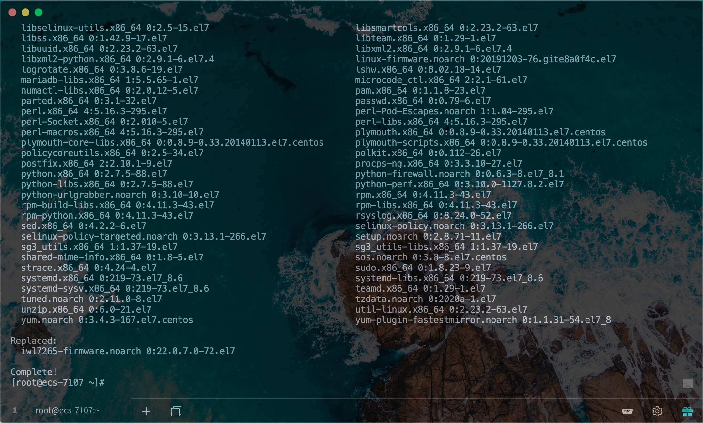
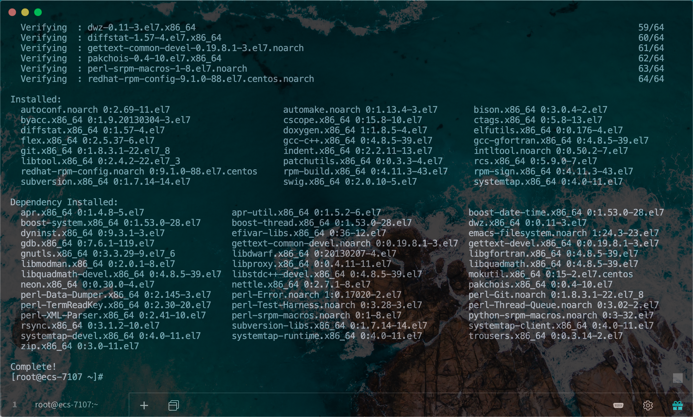
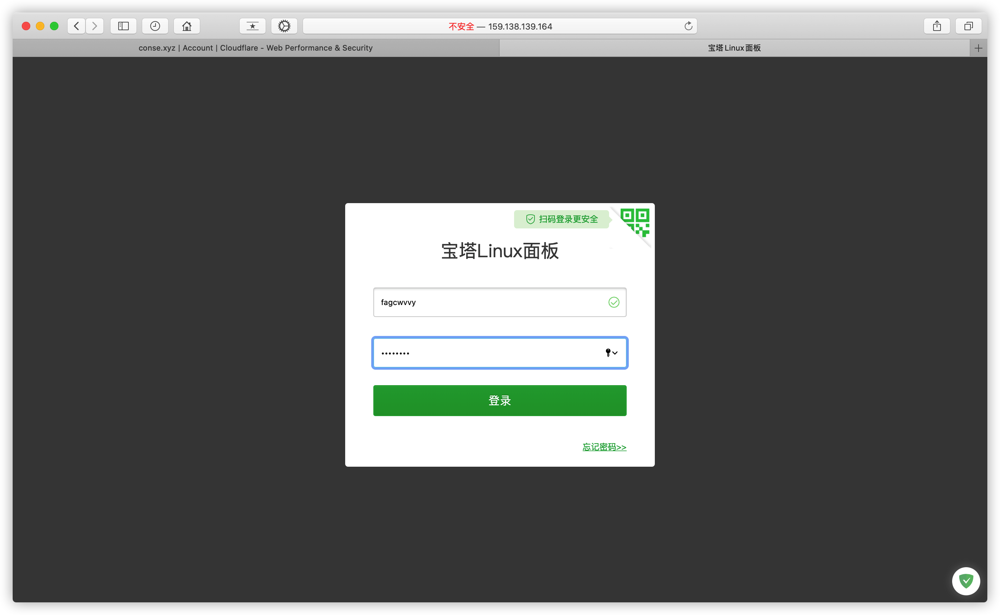
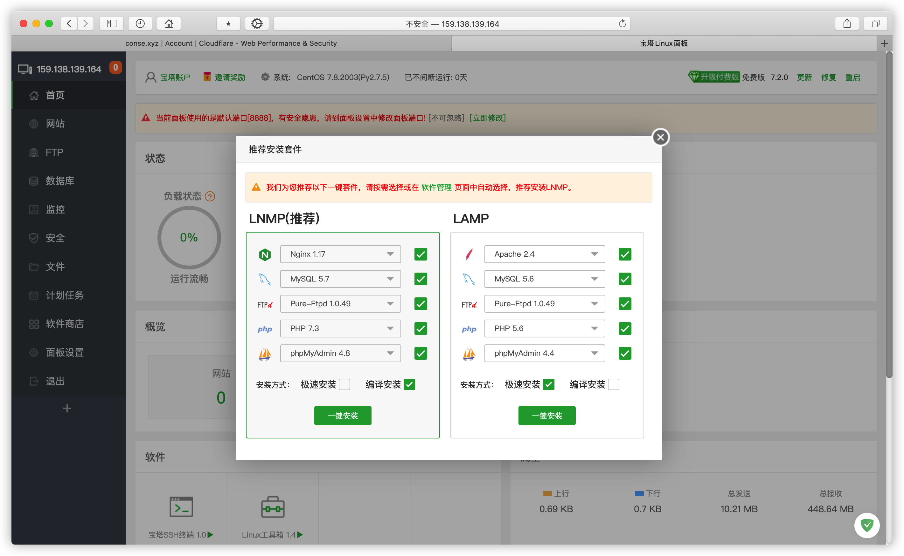
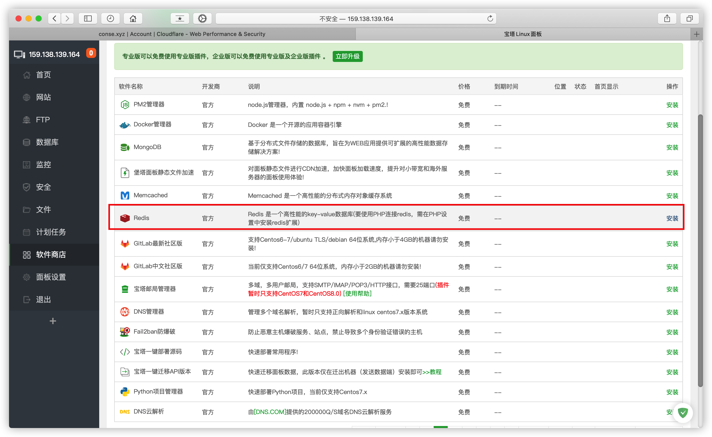
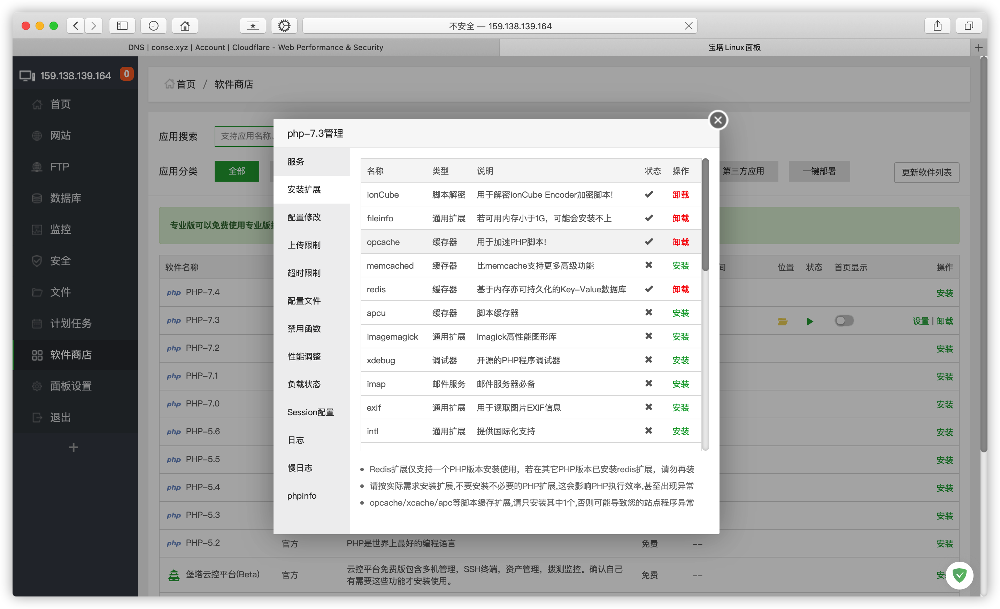
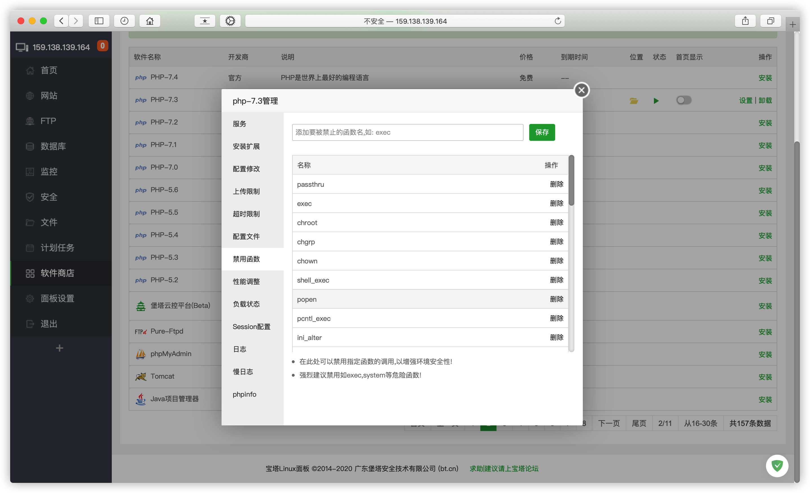

# 2. 安装宝塔

> 通过SSH工具访问服务器  
PS：推荐使用
[FinallShell](http://www.hostbuf.com/t/988.html)
丨[Terminus](https://www.termius.com/)

### 更新系统

```
yum update -y
```



### 安装开发工具包

```
yum -y groupinstall "Development Tools"
```



### 宝塔面板

```
yum install -y wget && wget -O install.sh http://download.bt.cn/install/install_6.0.sh && bash install.sh
```


> 输入 y 确认


#### 安装完成输出登录信息，建议单独保存

| Bt-Panel	| 登录地址 |
|-----------|---------|
| username  | 账户     |
| password  | 密码     |

### 浏览器访问宝塔面板登录



### 安装如图LNMP环境

> 强烈建议选择编译安装，安装时间较长，环境较为稳定



### 进入软件商店安装Redis



> 安装速度取决于服务器性能，静待安装完成  
完成后请确保所有可升级的软件升到**最新版本**

### 配置PHP

#### 安装扩展 ionCube fileinfo redis opache sg11



#### 禁用函数 proc_open putenv pcntl_alarm pcntl_signal getenv


