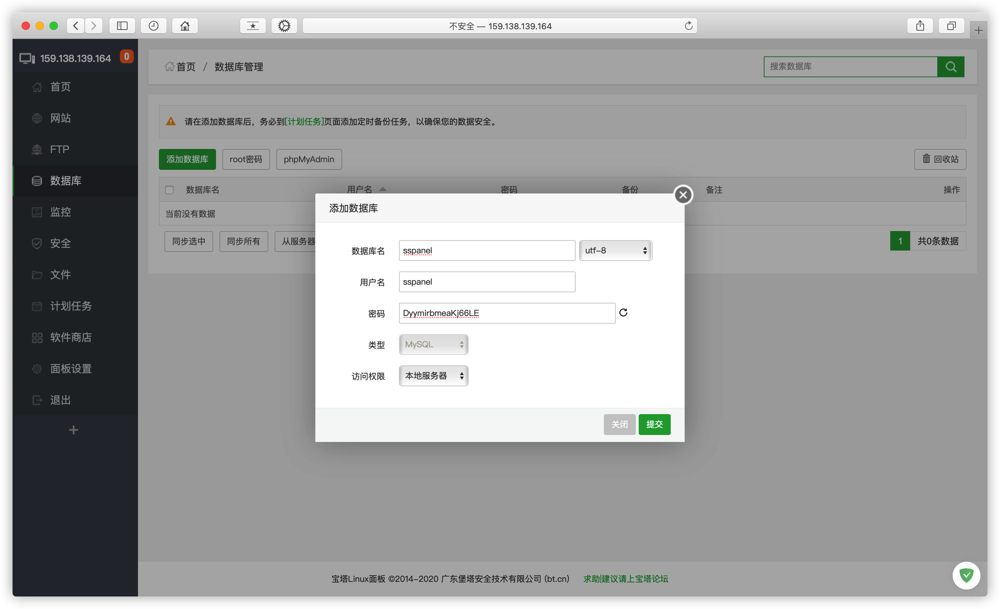
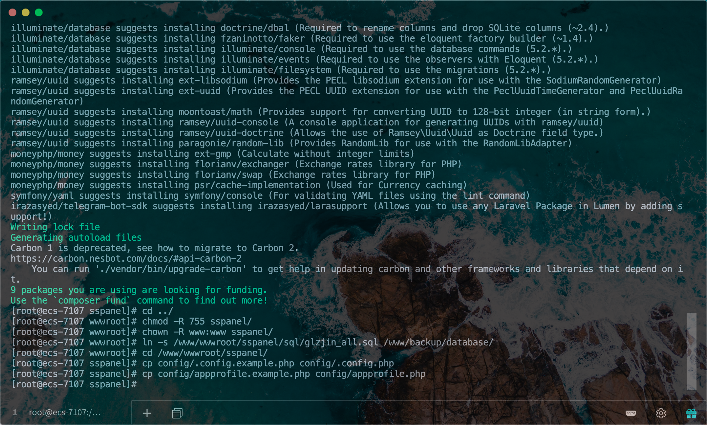
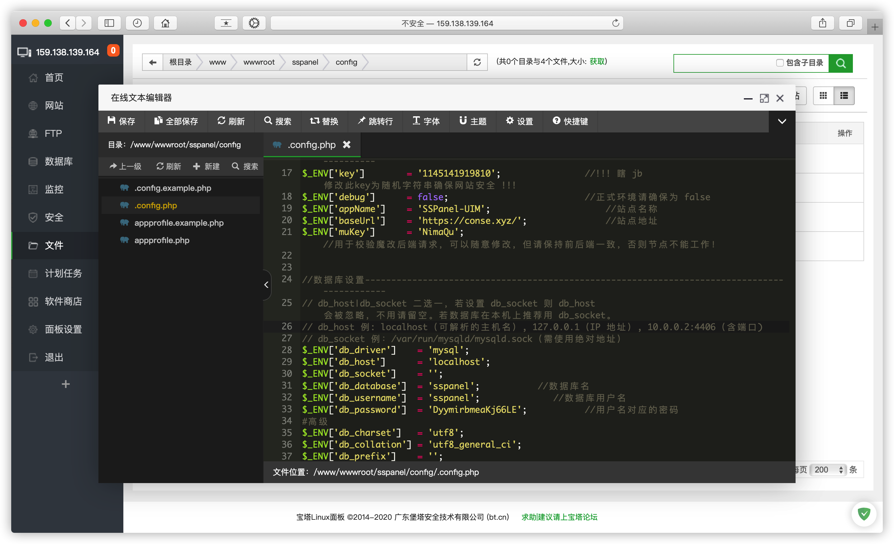

# 安装 SSPanel 面板

### 添加网站

> 本教程根目录为 **/www/wwwroot/sspanel**


域名DNS A记录解析到服务器ip


进入网站根目录添删除默认文件


伪静态

```text
location / {
    try_files $uri /index.php$is_args$args;
}
```


Shell终端执行以下命令

```bash
cd /www/wwwroot/sspanel
git clone -b dev https://github.com/Anankke/SSPanel-Uim.git tmp && mv tmp/.git . && rm -rf tmp && git reset --hard
git config core.filemode false
wget https://getcomposer.org/installer -O composer.phar
php composer.phar
php composer.phar install
cd ../
chmod -R 755 sspanel/
chown -R www:www sspanel/
ln -s /www/wwwroot/sspanel/sql/glzjin_all.sql /www/backup/database/
```


创建数据库



导入数据库


配置网站程序

```bash
cd /www/wwwroot/sspanel/
cp config/.config.example.php config/.config.php
cp config/appprofile.example.php config/appprofile.php
```



### 站点配置

配置文件

> 按照自己的需求修改 /config/.config.php 和 appprofile.php  
修改站点地址及数据库等信息并保存



创建管理员并同步用户

```bash
cd /www/wwwroot/sspanel/
php xcat User createAdmin
php xcat User resetTraffic
php xcat Tool initQQWry
php xcat Tool initdownload
```

> 如果创建管理员出错请检查 **config/.config.php** 中的数据库连接信息。


网站目录

> **站点管理 -> 网站目录 -> 运行目录 /pubilc ,取消 防跨站攻击**


SSL


此时网站可以正常访问


> 继续编辑网站配置文件，关闭Node.js新开发的首页


自定义

> 背景 /www/wwwroot/sspanel/public/images/bg.jpg  
> favicon /www/wwwroot/sspanel/public/favicon.ico  
> 网站名 /www/wwwroot/sspanel/config/.conig.php $\_ENV


定时任务

> 编辑 **/var/spool/cron** 下的 **root** 文件，添加以下四条：

```text
30 22 * * * php /www/wwwroot/sspanel/xcat sendDiaryMail
0 0 * * * php -n /www/wwwroot/sspanel/xcat dailyjob
*/1 * * * * php /www/wwwroot/sspanel/xcat checkjob
*/1 * * * * php /www/wwwroot/sspanel/xcat syncnode
```

> 如果需要自动备份，可模仿以下两例，自行添加一条。
> 每 20 分钟备份 1 次（若间隔大于 60 分钟看下个例子）：

```text
*/20 * * * * php -n /www/wwwroot/sspanel/xcat backup
```

> 每 20 小时备份 1 次（若间隔大于 24 小时请学会熟练使用搜索引擎）：

```text
0 */20 * * * php -n /www/wwwroot/sspanel/xcat backup
```

> 如果需要财务报表，可选添加以下三条：

```text
5 0 * * * php /www/wwwroot/sspanel/xcat sendFinanceMail_day
6 0 * * 0 php /www/wwwroot/sspanel/xcat sendFinanceMail_week
7 0 1 * * php /www/wwwroot/sspanel/xcat sendFinanceMail_month
```

> 如果需要检测被墙，需要添加：

```text
*/1 * * * * php /www/wwwroot/sspanel/xcat detectGFW
```

> 如果要用到 radius，需要添加下面这三条：

```text
*/1 * * * * php /www/wwwroot/sspanel/xcat synclogin
*/1 * * * * php /www/wwwroot/sspanel/xcat syncvpn
*/1 * * * * php -n /www/wwwroot/sspanel/xcat syncnas
```

注意底部需要保留一行空行


### 完成安装

前台界面


后台界面（地址 你的域名/admin）


### 邮件

发件配置

> 示例采用SMTP的QQ邮箱发件

登录网页版QQ邮箱 设置-账户

开启SMTP获取**授权码**


> 编辑 **/config/.config.php** 配置文件


### 通信密钥

> 编辑 **/config/.config.php** 配置文件 **$_ENV['muKey']** 参数


### 关闭节点ip验证

> 编辑 **/config/.config.php** 配置文件 **$_ENV['checkNodeIp']** 参数，将 true 改成 false


