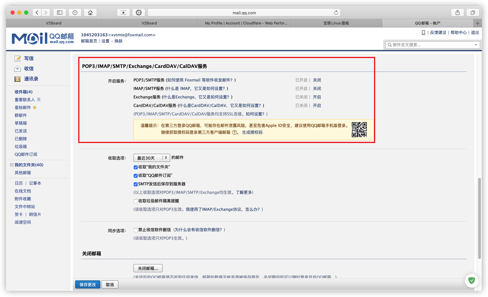
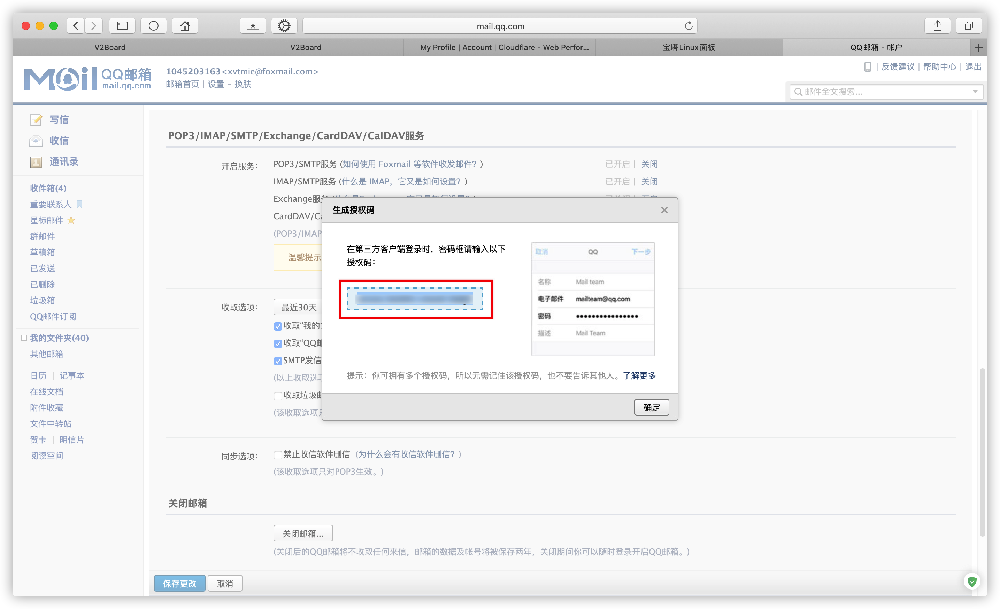

# 安装 v2board

### 目录

* [1. 域名配置](getting-started/yu-ming-pei-zhi.md)
* [2. 安装宝塔](getting-started/an-zhuang-bao-ta.md)

### 添加网站

> 本教程根目录为 **/www/wwwroot/v2board**


域名DNS A记录解析到服务器ip


进入网站根目录添删除默认文件


#### 伪静态

```text
location /downloads {
}

location / {  
    try_files $uri $uri/ /index.php$is_args$query_string;  
}

location ~ .*\.(js|css)?$
{
    expires      1h;
    error_log off;
    access_log /dev/null;
}
```


Shell终端执行以下命令

```bash
cd /www/wwwroot/
git clone https://github.com/v2board/v2board.git
cd v2board
wget https://getcomposer.org/download/1.9.0/composer.phar
php composer.phar install
cp .env.example .env
chown -R www ../v2board
```


> composer安装和更新的时候卡顿的话，换个其他源，以下任选其一

```text
#阿里云的composer镜像源
composer config -g repo.packagist composer https://mirrors.aliyun.com/composer/
#腾讯云的composer镜像源
composer config -g repo.packagist composer https://mirrors.cloud.tencent.com/composer/
```

创建数据库


执行命令进行面板的安装，填入对应的信息

```bash
php artisan v2board:install
```


站点配置

网站运行目录 站点管理-网站目录-运行目录 /pubilc


SSL


此时网站可以正常访问


定时任务

```text
php /www/wwwroot/v2board/artisan schedule:run
```


队列服务

> 安装PM2管理器


| 项目所在根目录 |	/www/wwwroot/v2board/ |
|----|----|
|启动文件名称	 | pm2.yaml |
|项目名称     |	v2board |


如果无法添加PM2

SSH终端安装 Node.js（依次执行）

```bash
curl -sL https://rpm.nodesource.com/setup_10.x | bash -
yum -y install nodejs
npm install -g n
n latest
n
node -v
```

安装pm2

```bash
npm install -g pm2
```

进入网站根目录

```bash
cd /www/wwwroot/v2board/
```

添加启动文件为pm2.yaml，APP名称为v2board的守护队列服务

```bash
pm2 start pm2.yaml --name v2board
```


更多命令

| 列出所有进程	     | pm2 ls |
|----------|--------|
| 查看进程具体情况	   | pm2 describe V2Board |
| 重启进程	       |   pm2 restart V2Board |
| 查看进程日志	     |   pm2 logs V2Board |
| 设置pm2开机自启	  |   pm2 startup centos |

其他

> 进入宝塔面板编辑网站根目录下的.env文件，修改必要信息


| APP_NAME |	网站名称 |
|----------|--------|
| APP_URL	 |  网站域名 |

### 完成安装

#### 前台界面


#### 后台界面（地址 你的域名/admin）


> PS：如果后台界面无法正常访问 请确保网站所有文件为 www 755 权限

#### 500 | Server Error 解决办法

> 检查站点根目录权限，递归755，保证目录有可写文件的权限，也有可能是Redis扩展没有安装或者Redis没有按照造成的。

* 将 .env 的 APP_DEBUG 改成 true
* 清除缓存的配置 php artisan config:clear
* 根据错误信息，修复问题
* 将 .env 的 APP_DEBUG 改成 false
* 缓存配置 php artisan config:cache

### 使用

#### 订阅

一些V2Board的特性避免你踩坑

#### 订阅周期

> 目前设计上订阅分为按周期、按量（v1.2+）的订阅方式。按周期订阅的话将会在账单日（v1.2+）或每月1号进行流量重置，按量的话流量将不会限制，直到流量用完后才会对用户进行停止。

#### 订阅升降级

**按周期更换订阅规则如下**

> 将更换前拥有的订阅按照使用比例计算后如果更换前的订阅价值大于更换后的，将会退还多出来的余额到账户中，如果小于则补差价。  
场景1：A订阅月付10元 B订阅月付20元，A已经使用了半个月要更换到B订阅  
首先系统会计算出A的单价，一个月30天，10/30=0.33，A已经使用了半个月了那就是15天，15*0.33=4.95。A订阅的价格是10元，10-4.95=5.05，这个时候B订阅为20元，20-5.05=14.95，该用户升级到B订阅需要付费14.95，反之同理。

**一次性付费更换订阅规则如下(v1.2+)**

> 假设A用户购买了10G流量价值10元的订阅，使用了5G，那么更换套餐后先前的套餐剩余价值5元将会被退款。

#### 节点

**连接端口和服务端口有什么区别**

> 连接端口是用户连接所使用的端口，服务端口为节点提供服务所使用的端口。假设你有一台中转服务器将A服务器1234端口数据转发到B服务器4567端口，那么用户连接A服务器，而服务部署于B服务器。

> **服务端口**：例（如果使用的是NAT服务器，可以将服务端口设置为443由主机商将443转发至30443后，连接端口即为30443，服务端口443。

> **协议详细配置**： 点击参考V2ray 配置如果你使用的是Websocket 可以点击 针对 WebSocket 连接的配置进行配置

> **父节点**：如果你使用的是多中转节点单台服务器进行落地使用，可以只为落地服务器运行服务端，其他节点选择该落地服务器节点即同步落地服务器的所有状态和数据。

#### 邮件

##### 发件配置

> 示例采用SMTP的QQ邮箱发件

登录网页版QQ邮箱 设置-账户

开启SMTP获取授权码





> **编辑网站根目录下的.env配置文件**


| 参数	             | 解析 |
|------------|------------|
| MAIL_HOST	      |   SMTP服务器 QQ邮箱为smtp.qq.com |
| MAIL_PORT	      |   SMTP端口 QQ邮箱为465或587 |
| MAIL_PASSWORD	  |   刚生成的授权码 |
| MAIL_USERNAME	  |   QQ邮箱账户 |
| MAIL_ENCRYPTION	|   加密方式 SSL |

#### 自定义邮件模板

除了系统内置的模板，你可以创建你自己的模板进行使用。

首先你需要前往 /resources/views/mail ，这个目录下存放着邮件模板主题，你可以复制default主题并重命名为自己的主题名字对主题内的 .blade.php 文件进行修改。

| 文件名	          | 名称 |
|------------|------------|
| notify	       |   用于自定义内容通知的模板 |
| remindExpire	 |   过期通知模板 |
| remindTraffic	|     流量告警通知模板 |
| verify	       |   邮件验证模板 |

#### 邮件无法发出

请检查pm2服务是否启动成功，如果确定启动成功还是无法发送请尝试更改配置文件邮件部分将 MAIL_FROM_NAME 的值配置的与 MAIL_FROM_ADDRESS 相同，另外配置完邮箱需要执行`php artisan config:cache`重新缓存一下配置信息，这个方式未来将会被优化。

**购买后状态处于开通中**

请检查计划任务是否可用且有效，V2Board诸多服务依赖于计划任务，如果你没有配置的话订单或佣金分配都将出现问题。

#### 系统配置

> 根据需求自己配置


#### 支付配置

> 推荐使用 [PayTaro](https://v1.paytaro.com/)，注册之后签约支付（支付宝/微信）


> 获取ID和密钥


> 在后台面板填入即可


#### 创建权限组


#### 创建订阅

| 参数	   | 描述 |
|------------|------------|
| 套餐名称	 |   套餐名称 |
| 售价设置	 |   设置售价，留空为不出售 |
| 套餐流量	 |   月流量，每月1号会自动清空 |
| 权限组	  |     用户只能连接权限组内的节点 |


> 销售状态：开启后才会在用户中心展示  
续费：开启后才允许用户续费

#### 通信密钥及后端授权

> **授权文件为Poseidon授权，未授权只能限制 50 人使用。**

> 用户数说明：限制 50 人时，请按面板用户数来算，如果你发现超过 50 还能用，那是你赚到的，与此同时你需要承担相应的风险，可能在某个时刻后端会集体挂掉，重启也无法启动，所以请在面板人数小于等于 50 时，加群购买授权码，以防出现无法服务的情况。
50人限制的真实含义：面板有效用户数。有效用户为那些有权连接到你的节点的用户，一般来说就是流量没超、还没到期、以及未被管理员封禁的那些用户。


