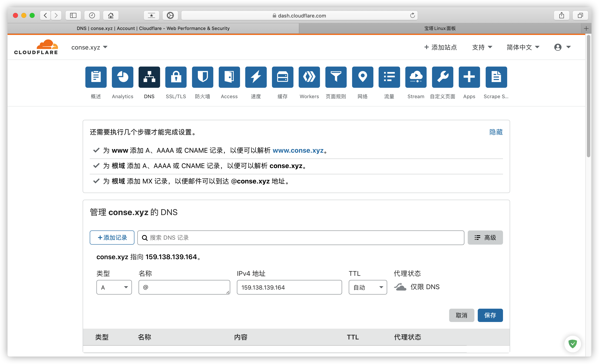

# 安装 VNetPanel 面板

> Linux 服务器（操作系统Centos7）  
域名  
Shell 终端  
VNetPanel，该面板为付费面板，请找 [VNetPanel 作者](https://t.me/esp8266mod) 或 [藤原 佑为](https://t.me/garhing) 进行购买

### 目录

* [1. 域名配置](getting-started/yu-ming-pei-zhi.md)
* [2. 安装宝塔](getting-started/an-zhuang-bao-ta.md)

### 添加网站

> 本教程根目录为/www/wwwroot/vnetpanel


### 域名 DNS A 记录解析到服务器 IP



### 进入网站根目录添删除默认文件


### 伪静态 选择 laravel5


### 上传源码到网站根目录并解压


### 创建数据库 编码 utf8mb4


### 安装依赖

```
cd /www/wwwroot/vnetpanel
php composer.phar install
```


### 网站目录

> 站点管理-网站目录-运行目录 /pubilc,取消 防跨站攻击


### SSL


### 此时网站进入安装界面，填入对应数据库信息


> 默认登陆信息 **admin**丨**123456**


### 定时任务

> 在 **/var/spool/cron** 目录下新建 **www** 文件，写入下面内容并设置权限为 **root 600**

```
* * * * * /www/server/php/73/bin/php /www/wwwroot/vnetpanel/artisan schedule:run >> /dev/null 2>&1
```

> 注意底部需要保留一行空行


### 设置推送

> 软件商店 安装并打开 **Supervisor管理器** > 添加守护进程

| 启动用户 | www |
|---------|-----|
| 运行目录	| /www/wwwroot/vnetpanel/ |
| 启动命令	| /www/server/php/73/bin/php /www/wwwroot/vnetpanel/artisan queue:work redis --daemon --queue=default --timeout=60 --tries=3 -vvv |


> 确保状态为 **RUNNING**，无法正常启动请检查PHP扩展及函数，网站文件权限等。


## 完成安装

### 前台界面


### 后台界面（地址 你的域名/admin）


> 后台-工具箱-系统运行日志  
正常显示日志表示正常运行


## 邮件

### 发件配置

> 示例采用SMTP的QQ邮箱发件

登录网页版QQ邮箱 设置-账户

开启SMTP获取授权码


> 编辑网站根目录下的**.env**配置文件


| MAIL_HOST | SMTP服务器 |
|-----------|-----------|
| MAIL_PORT | SMTP端口   |
| MAIL_USERNAME | 邮箱地址     |
| MAIL_PASSWORD | SMTP授权码   |
| MAIL_ENCRYPTION | ssl |
| MAIL_FROM_ADDRESS | 邮箱地址  |
| MAIL_FROM_NAME | 发件人名称   |

**转到Supervisor管理器，重启守护进程生效**

### 消息推送

> 进入后台管理 获取**Server酱**的 **SCKEY** 填入

[Server酱](http://sc.ftqq.com/3.version)


