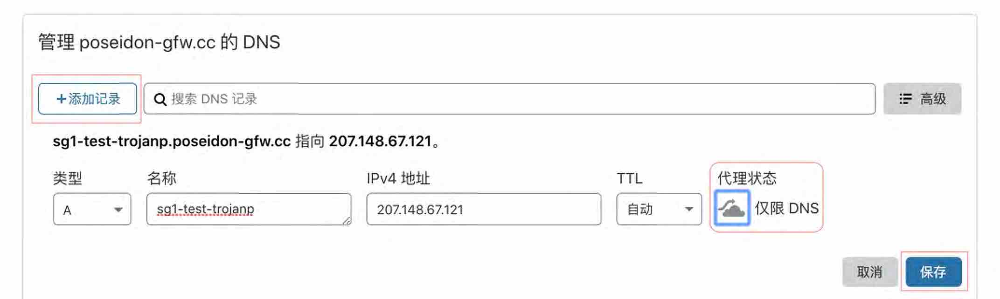
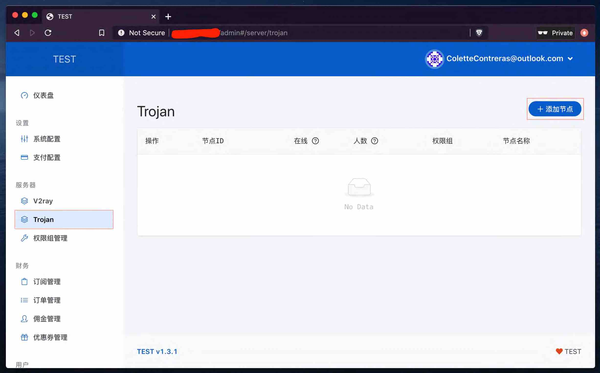
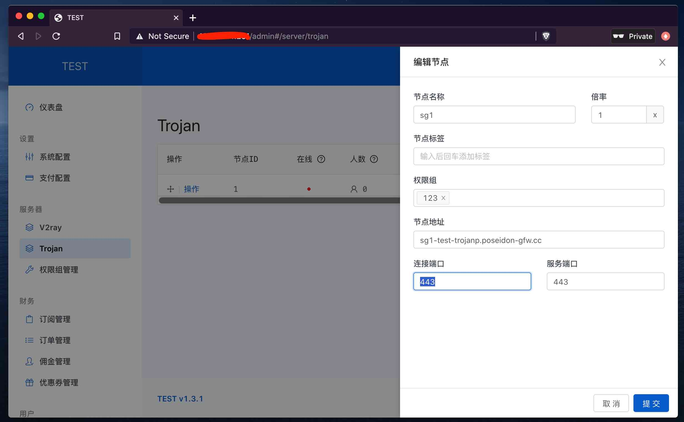
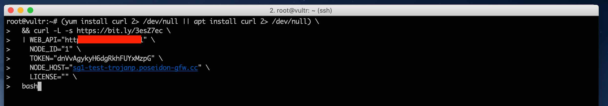
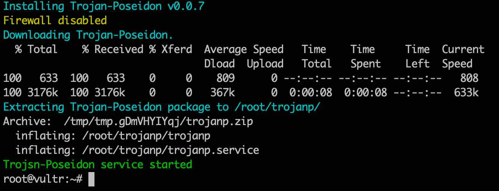
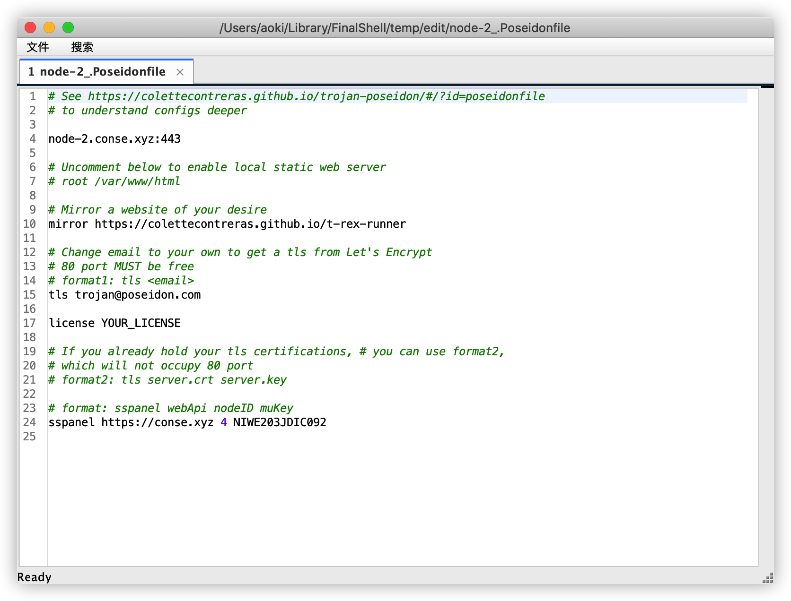
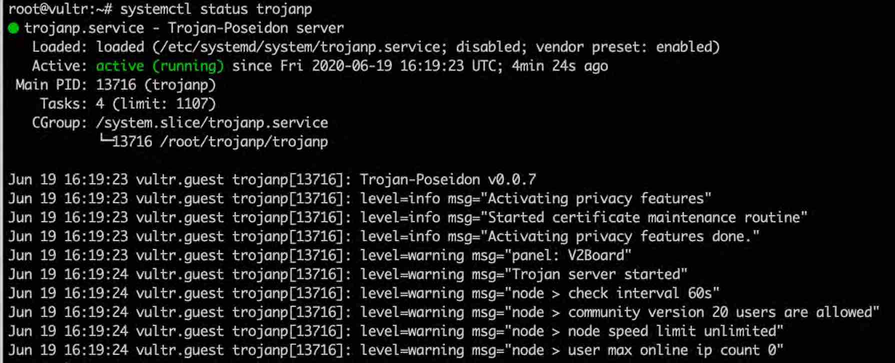
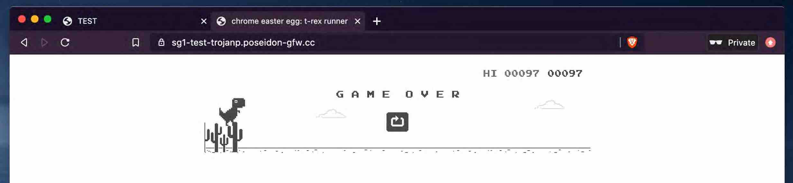
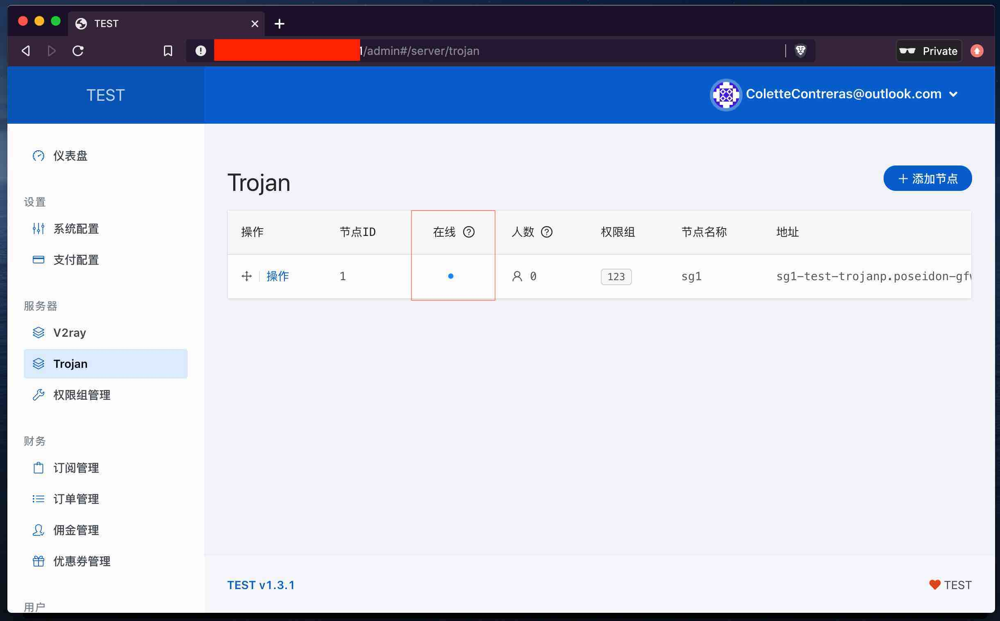

# 搭配 V2Board 面板

### 目录

* [1. 域名配置](../zhun-bei-gong-zuo/yu-ming-pei-zhi.md)
* [2. 安装宝塔](../zhun-bei-gong-zuo/an-zhuang-bao-ta.md)
* [3. 安装 V2Board 面板](../zhun-bei-gong-zuo/3.-an-zhuang-pei-zhi-mian-ban/install-v2board.md)

## Trojan Poseidon

### 添加节点

> **搭建 Trojan 前需要为该节点准备一个域名,必须采用TLS加密**

**将域名 A 记录指向节点 IP**



**添加 Trojan 节点**





### 节点部署

CentOS 需要先关闭 SELinux

```text
sed -i 's/enforcing/disabled/g' /etc/selinux/config /etc/selinux/config
# 修改完之后需要重启系统
reboot
```

```bash
(yum install curl 2> /dev/null || apt install curl 2> /dev/null) \
  && curl -L -s https://bit.ly/3esZ7ec \
  | WEB_API="面板地址" \
    NODE_ID="节点ID" \
    TOKEN="通信密钥" \
    NODE_HOST="节点域名" \
    LICENSE="授权码" \
  bash
```

> PS：无授权码请保证LICENSE=为空，有授权码则填入授权，**社区版仅供20人小团队使用**





### 配置文件



### 启动

```bash
systemctl start trojanp
```

### 查看状态

```bash
systemctl status trojanp
```

> 状态显示 **Active: active \(running\)** 表示正常运行，非正常状态请查看日志（`journalctl -x -n 300 --no-pager -u trojanp`）排查原因



**直接访问** [https://你的域名](https://你的域名)

可以看到默认的小恐龙游戏，你也可以修改 `/root/trojanp/Poseidonfile` 中的 `mirror` 改成任意的网站



> 在面板中可以看到节点已经在线了



### 更多

| 日志 | journalctl -x -n 300 --no-pager -u trojanp |
| :--- | :--- |
| 启动 | systemctl start trojanp |
| 停止 | systemctl stop trojanp |
| 状态 | systemctl status trojanp |
| 实时日志 | journalctl -u trojanp -f |

更新

```bash
curl -L -s https://bit.ly/3esZ7ec | bash
```

卸载

```bash
curl -L -s https://bit.ly/2Jl9bs7 | bash
```

#### 一般情况下需要注意以下几点：

* V2ray 和 Trojan 不能在同一台机子上开启 TLS，443端口冲突
* Trojan 部署不成功通常是因为没有获取到 TLS 证书
* 启动 Trojan 之前先确定域名解析是否完成
* 启动 Trojan 之后等待一两分钟获取 TLS 证书
* 面板开启 WebAPI

## 商业授权

### 商业授权版价格（单位USDT）

| 人数 | ≤1000 | ≤4000 | ＞4000 |
| :--- | :--- | :--- | :--- |
| 一年 | 80 | 160 | 240 |
| 两年 | 145 | 290 | 430 |
| 三年 | 200 | 400 | 600 |
| 永久 | 350 | 700 | 1000 |

> 备注：以上授权均为在线授权，修改域名/面板一次 5USDT
>
> [购买 Trojan Poseidon 商业授权](https://t.me/mara915)  
> [订阅 Trojan Poseidon 频道获取最新消息](https://t.me/trojan_poseidon)

