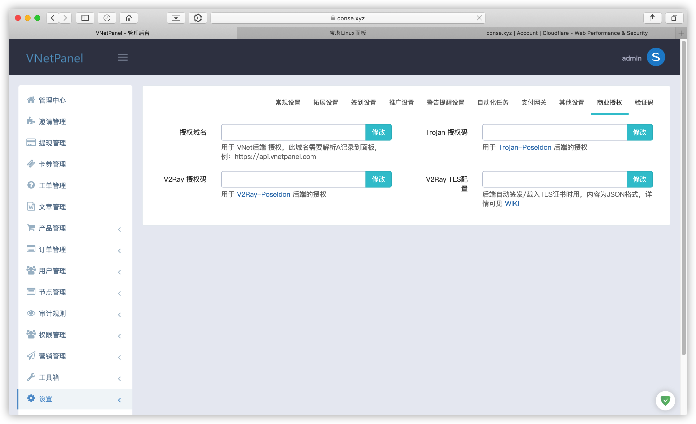
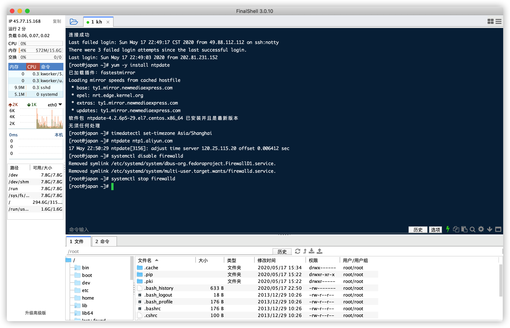
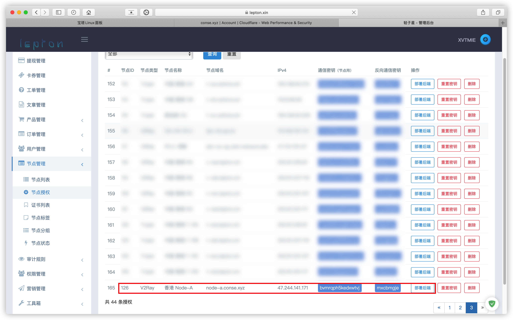

# 搭配 VNetPanel 面板

### 目录

* [1. 域名配置](../zhun-bei-gong-zuo/yu-ming-pei-zhi.md)
* [2. 安装宝塔](../zhun-bei-gong-zuo/an-zhuang-bao-ta.md)
* [3. 安装 VNetPanel 面板](../zhun-bei-gong-zuo/3.-an-zhuang-pei-zhi-mian-ban/install-vnetpanel.md)

### 商业授权

**填入Poseidon授权码及TLS配置，授权码需要购买，无试用。**

> TLS配置（以CloudFlare为例）

```javascript
{"provider": "cloudflare", "email": "", "api_key": ""}
```

**获取 CloudFlare api\_key**

> CloudFlare -&gt; 右上角头像 -&gt; 我的个人资料 -&gt; API令牌 -&gt; Global API Key -&gt; 查看



## 节点部署（以WebSocket-TLS 模式为例）

> 节点服务器 Centos7 X64

通过SSH工具访问服务器

### CentOS 禁用 SELinux

```text
sed -i 's/enforcing/disabled/g' /etc/selinux/config /etc/selinux/config
# 修改完之后需要重启系统
reboot
```

### 安装加速

> 推荐使用BBR2或BBRPlus

```bash
yum install wget
wget -N --no-check-certificate "https://github.000060000.xyz/tcp.sh" && chmod +x tcp.sh && ./tcp.sh
```


**reboot** 重启完成后 `./tcp.sh` 进入管理脚本，开启加速


### 同步时间

#### Debian/Ubuntu

```bash
apt-get install -y ntp
service ntp restart
```

#### CentOS/RHEL

```bash
yum -y install ntpdate
timedatectl set-timezone Asia/Shanghai
ntpdate ntp1.aliyun.com
```


#### 关闭防火墙

```bash
systemctl disable firewalld
systemctl stop firewalld
```



### 添加伪装域名

> 节点管理 -&gt; 证书列表 -&gt; 添加域名证书


> **填写伪装域名，KEY和PEM为证书，可填可不填**


#### CloudFlare 节点域名解析，将节点地址通过A记录指向节点服务器 IP，云朵灰色


#### 新增节点

**TLS+WebSocket模式**

> 域名与伪装域名相同


**WebSocket模式**

> 连接端口和服务端口可任意更换  
> 域名与伪装域名相同


#### 节点授权

> 在节点授权界面找到刚添加的节点 点击部署后端



> 弹出的V2Ray-Poseidon命令为节点部署命令


### 部署节点

> 将上面的部署命令直接复制到节点服务器终端，运行即可


#### 查看运行状态

```bash
systemctl status v2ray
```

> 状态显示 **Active: active \(running\)** 表示正常运行，非正常状态请查看日志（journalctl -x -n 300 --no-pager -u v2ray ）排查原因


#### 此时节点列表显示节点状态及运行时间


> 无法正常使用请获取运行日志到 [V2Ray Poseidon](https://t.me/v2ray_poseidon) 提问

### 更多命令

> 更新 **curl -L -s** [https://bit.ly/2VhvcPz](https://bit.ly/2VhvcPz) **\| bash**  
> 卸载 **curl -L -s** [https://bit.ly/2SGFMMY](https://bit.ly/2SGFMMY) **\| bash**

| 日志 | journalctl -x -n 300 --no-pager -u v2ray |
| :--- | :--- |
| 停止 | systemctl stop v2ray |
| 状态 | systemctl status v2ray |
| 启动 | systemctl start v2ray |
| 重启 | systemctl restart v2ray |

### 更多配置模式

先介绍下 VNetPanel 节点设置的几个参数，明白之后就可以自由组合了。

| 参数 | 说明 |
| :--- | :--- |
| 服务端口 | V2Ray 所监听的端口 |
| 连接端口 | 用户连接时的端口，直连 V2Ray 的话和服务端口一致，如果不是直连比如通过了中转或使用了反向代理进行转发，则填写中转或反向代理的端口 |
| 服务端 | TLS    是否启用 V2Ray TLS，原始的 V2Ray 需要自己去处理证书，V2Ray-Poseidon可以自动帮你处理 TLS 证书，请参阅《配置 TLS 证书》提供相应的信息 |
| 连接 | TLS    用户连接时是否启用 TLS |
| TLS | 服务商授权    当服务端 TLS为启用时，必须配置该参数 |

#### TCP 模式

> 传输协议 =&gt; TCP  
> 服务端 TLS =&gt; 禁用  
> 服务端口 =&gt; 10086 \( 你可以设置为你可用的任何端口 \)  
> 连接端口 =&gt; 10086

#### 给 TCP 套上 TLS 证书

> 准备一个域名比如 v2node-01.vnetpanel.com，并解析到该节点地址  
> 域名和伪装域名都设置为 v2node-01.vnetpanel.com  
> 传输协议改成 TCP  
> 启用 TLS  
> TLS服务商授权 参照《配置 TLS 证书》规则，填上你域名提供商的信息

#### WebSocket 模式 \(直连\)

> 传输协议改成 WebSocket  
> 禁用 TLS  
> 保证路径不为空，由 VNetPanel 自动生成的就非常安全，例如：/gahutaodoy8dcs21，每个节点都不一样

#### WebSocket + 百度 CDN

> 据 @vft9ness 大佬所说：使用百度 CDN 都不建议开启 TLS，所以直接按《WebSocket 模式》配置，然后把端口改为 80即可。

#### WebSocket + TLS 模式 \(直连\)

> 准备一个域名比如 v2node-01.vnetpanel.com，并解析到该节点地址，保证 CF 后面的小云朵为灰色的  
> 域名和伪装域名都设置为 v2node-01.vnetpanel.com  
> 传输协议改成 WebSocket  
> 保证路径不为空，由 VNetPanel 自动生成的就非常安全，例如：/gahutaodoy8dcs21，每个节点都不一样  
> 服务端口 =&gt; 443 \( 你可以设置为你可用的任何端口 \)  
> 连接端口 =&gt; 443  
> 服务端 TLS =&gt; 启用  
> 连接 TLS =&gt; 启用  
> TLS服务商授权 参照《配置 TLS 证书》规则，填上你域名提供商的信息

#### WebSocket + CloudFlare CDN = WebSocket + CF CDN + TLS\(这个证书是由 CF 自动生成的）

> 准备一个域名比如 v2node-01.vnetpanel.com，并解析到该节点地址，并点亮 CF 后面的小云朵，CF 的 SSL/TLS 改为 Flexible  
> 域名和伪装域名都设置为v2node-01.vnetpanel.com  
> 服务端口 =&gt; 80  
> 连接端口 =&gt; 443  
> 传输协议 =&gt; WebSocket  
> 保证路径不为空，由 VNetPanel 自动生成的就非常安全，例如：/gahutaodoy8dcs21，每个节点都不一样  
> 服务端 TLS =&gt; 关闭  
> 连接 TLS =&gt; 启用

### 配置 TLS 证书

**使用已有证书**

```javascript
{"provider": "local", "certPath": "/etc/v2ray/v2ray.crt", "keyPath": "/etc/v2ray/v2ray.key"}
```

使用 DNS 验证，自动生成 TLS 证书

通过 DNS 验证来生成证书，这样不需要端口占用，较为方便和通用

> CloudFlare  
> {"provider": "cloudflare", "email": "", "api\_key": ""}
>
> Alibaba Cloud DNS  
> {"provider": "alidns", "email": "", "access\_key": "", "secret\_key": ""}
>
> Gandi  
> {"provider": "gandi", "email": "", "api\_key": ""}
>
> Go Daddy  
> {"provider": "godaddy", "email": "", "api\_key": "", "api\_secret": ""}

## 商业授权

> **Poseidon授权，未授权只能限制 50 人使用。**  
> 用户数说明：限制 50 人时，请按面板用户数来算，如果你发现超过 50 还能用，那是你赚到的，与此同时你需要承担相应的风险，可能在某个时刻后端会集体挂掉，重启也无法启动，所以请在面板人数小于等于 50 时，加群购买授权码，以防出现无法服务的情况。  
> 50人限制的真实含义：面板有效用户数。有效用户为那些有权连接到你的节点的用户，一般来说就是 **流量没超、还没到期、以及未被管理员封禁** 的那些用户。

### 商业授权版价格（单位USDT）

| 人数 | ≤2000 | ≤6000 | 无限 |
| :--- | :--- | :--- | :--- |
| 一年 | 65 | 130 | 200 |
| 两年 | 115 | 230 | 330 |
| 三年 | 159 | 310 | 450 |
| 永久 | 220 | 440 | 660 |

> 备注：以上授权均为在线授权，修改域名/面板一次 5USDT  
> 该授权为虚拟物品，不支持退款，请先使用社区版测试所有功能，如果能达到您的预期再进行购买。
>
> [购买V2Ray Poseidon商业授权](https://t.me/mara915)

