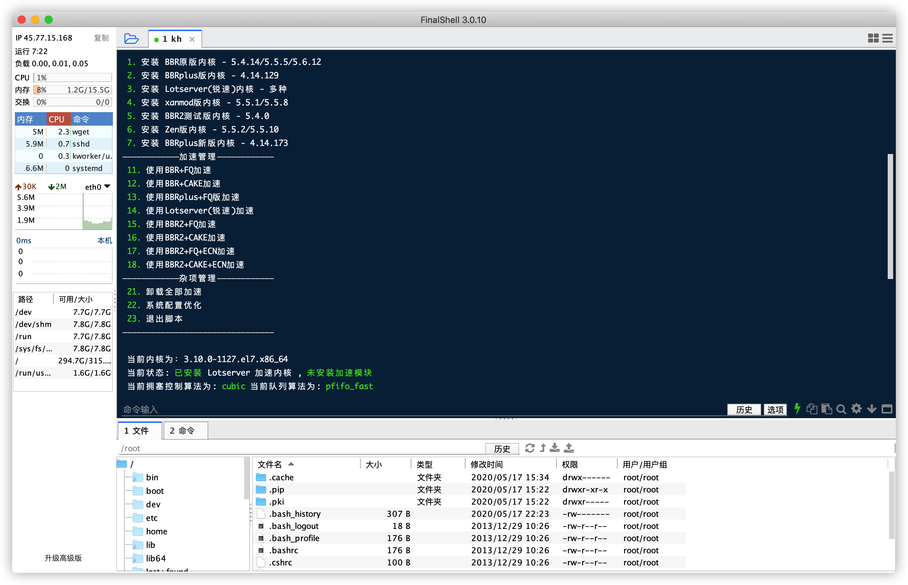
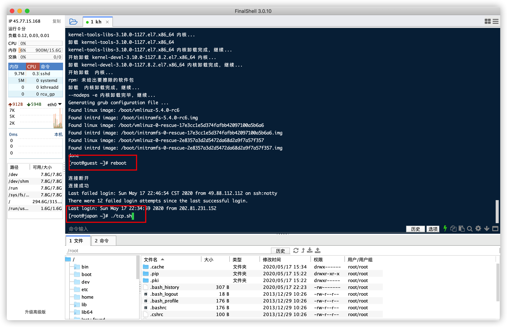
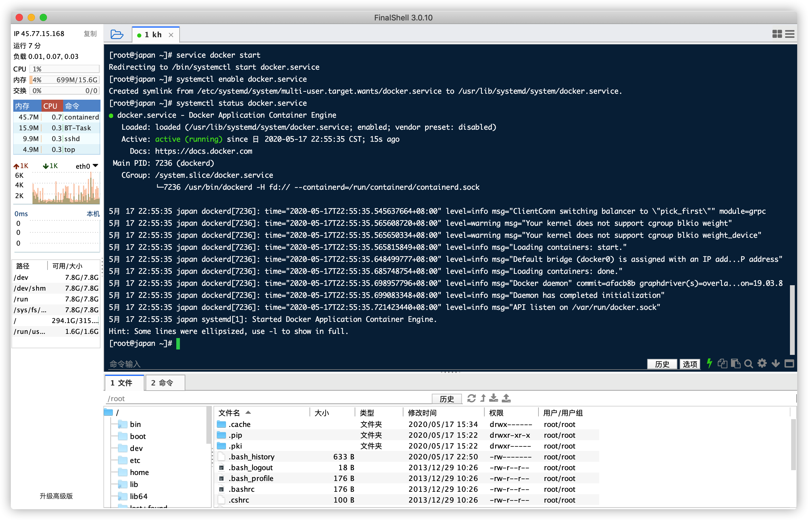
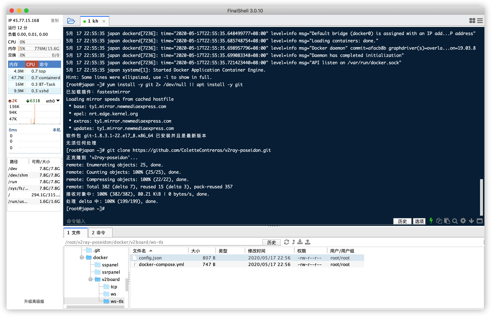
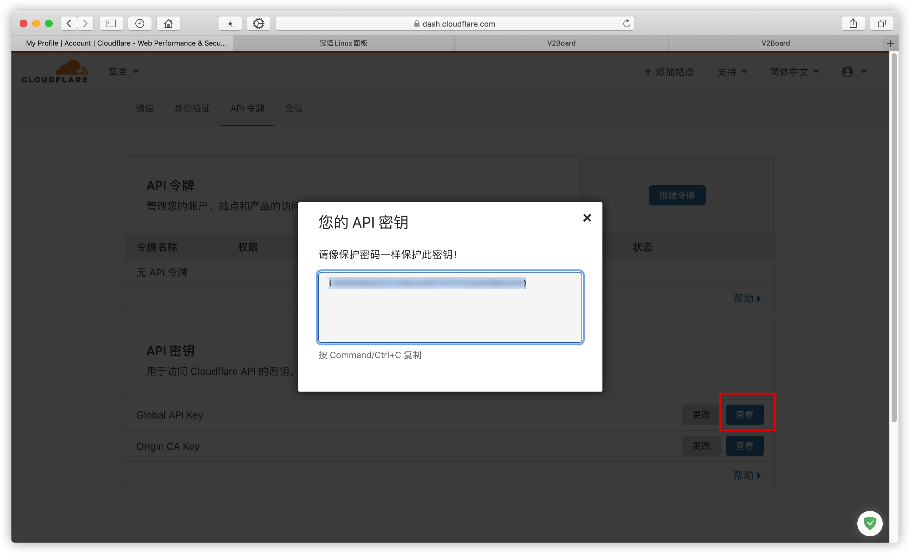

# 搭配 V2Board 面板

### 目录

* [1. 域名配置](../zhun-bei-gong-zuo/yu-ming-pei-zhi.md)
* [2. 安装宝塔](../zhun-bei-gong-zuo/an-zhuang-bao-ta.md)
* [3. 安装 V2board 面板](../zhun-bei-gong-zuo/3.-an-zhuang-pei-zhi-mian-ban/install-v2board.md)

## 节点部署（以WebSocket-TLS 模式为例）

> 节点服务器 Centos7 X64

通过SSH工具访问服务器

CentOS 禁用 SELinux

```text
sed -i 's/enforcing/disabled/g' /etc/selinux/config /etc/selinux/config
# 修改完之后需要重启系统
reboot
```

安装加速

> 推荐使用BBR2或BBRPlus

```bash
yum install wget
wget -N --no-check-certificate "https://github.000060000.xyz/tcp.sh" && chmod +x tcp.sh && ./tcp.sh
```



> **reboot** 重启完成后 `./tcp.sh` 进入管理脚本，开启加速




### 同步时间

#### Debian/Ubuntu

```bash
apt-get install -y ntp
service ntp restart
```

#### CentOS/RHEL

```bash
yum -y install ntpdate
timedatectl set-timezone Asia/Shanghai
ntpdate ntp1.aliyun.com
```


关闭防火墙

```bash
systemctl disable firewalld
systemctl stop firewalld
```


安装并启动 Docker/docker-compose

```bash
curl -fsSL https://get.docker.com | bash
curl -L "https://github.com/docker/compose/releases/download/1.25.3/docker-compose-$(uname -s)-$(uname -m)" -o /usr/local/bin/docker-compose
chmod a+x /usr/local/bin/docker-compose
rm -f `which dc`
ln -s /usr/local/bin/docker-compose /usr/bin/dc

systemctl start docker
service docker start
systemctl enable docker.service
systemctl status docker.service
```

**依次** 执行上面命令，**docker.service为active \(running\)** 时表示正常



#### CloudFlare节点域名解析，将节点地址通过A记录指向节点服务器iP，云朵灰色


#### 后台新增节点，TLS+WebSocket模式，连接端口和服务端口均为443，按需求添加审计规则或DNS规则


```bash
yum install -y git 2> /dev/null || apt install -y git
git clone https://github.com/ColetteContreras/v2ray-poseidon.git
```



修改配置文件

> 修改/root/v2ray-poseidon/docker/v2board/ws-tls目录下的config.json
>
> "nodeId": // 面板里添加完节点后生成的自增ID "webapi": "",// v2board 的域名信息 "token": "", // v2board 和 v2ray-poseidon 的通信密钥


修改 `/root/v2ray-poseidon/docker/v2board/ws-tls` 目录下的 `docker-compose.yml`

#### 配置 TLS 证书

有三种配置证书的方式：

1. 使用 dns 验证生成证书

> CERT\_MODE = dns  
> DNS\_PROVIDER = dns\_cf \# 修改为你的域名托管服务商  
> CERT\_DOMAIN = yourdomain.com \# 证书的域名  
> 然后根据自己的服务商修改下面的选项

Cloudflare key获取

> CloudFlare-右上角头像-我的个人资料-API令牌-Global API Key-查看




1. 使用 http（即机器的 80 端口）生成证书

> ports 下面的 80 端口映射到主机并放行
>
> * "80:80"  
>
>   CERT\_MODE   = http  
>
>   CERT\_DOMAIN = yourdomain.com

1. 已有证书文件

> 把证书文件通过 volume 映射到容器，假设你的证书文件在当前目录下，文件名为 v2ray.crt 和 v2ray.key  
> 将 CERT\_FILE 和 KEY\_FILE 前面的注释删除  
> CERT\_FILE = /etc/v2ray/v2ray.crt \# 和映射的冒号后面的路径一致  
> KEY\_FILE = /etc/v2ray/v2ray.key \# 和映射的冒号后面的路径一致

编辑完成后保存

#### 启动节点

```bash
cd /root/v2ray-poseidon/docker/v2board/ws-tls
dc up -d
```

#### 查看运行日志

```bash
dc logs
```

日志无报错此时节点状态为蓝色，打开显隐开关用户中心就能看到节点


> 无法正常使用请获取运行日志到 [V2Ray Poseidon](https://t.md/v2ray_poseidon) 提问

### 更多节点配置

> v2ray-poseidon/docker/v2board

#### TCP 模式

```bash
cd tcp
```

1. 修改 config.json 中的 poseidon 下面的配置
2. 修改 docker-compose.yml 的服务端口

启动

```bash
dc up -d
```

#### CloudFlare CDN + WebSocket 模式1

1. v2board 中节点的连接端口和服务端口都得为 443
2. CloudFlare 打开代理
3. 修改配置文件并启动 docker

```bash
cd ws
```

修改 config.json 中的 poseidon 下面的 nodeId, webapi, 和 token

启动

```bash
dc up -d
```

#### WebSocket-TLS 模式2

该模式下请确保 CloudFlare 解析的那边图标是灰色的（也就是不用 CF 的 CDN，只用来做域名解析）

```bash
cd ws-tls
```

1. 修改 config.json 中的 poseidon 下面的配置
2. 修改 docker-compose.yml 中的配置，根据你的 DNS 信息

启动

```bash
dc up -d
```

#### 更多

下列命令在 `/root/v2ray-poseidon/docker/v2board/` 对应目录下执行

| 启动 | dc up -d |
| :--- | :--- |
| 停止 | dc stop |
| 重启 | dc restart |
| 查看日志 | dc logs |

## 商业授权

> **Poseidon授权，未授权只能限制 50 人使用。**  
> 用户数说明：限制 50 人时，请按面板用户数来算，如果你发现超过 50 还能用，那是你赚到的，与此同时你需要承担相应的风险，可能在某个时刻后端会集体挂掉，重启也无法启动，所以请在面板人数小于等于 50 时，加群购买授权码，以防出现无法服务的情况。  
> 50人限制的真实含义：面板有效用户数。有效用户为那些有权连接到你的节点的用户，一般来说就是 **流量没超、还没到期、以及未被管理员封禁** 的那些用户。

### 商业授权版价格（单位USDT）

| 人数 | ≤2000 | ≤6000 | 无限 |
| :--- | :--- | :--- | :--- |
| 一年 | 65 | 130 | 200 |
| 两年 | 115 | 230 | 330 |
| 三年 | 159 | 310 | 450 |
| 永久 | 220 | 440 | 660 |

> 备注：以上授权均为在线授权，修改域名/面板一次 5USDT  
> 该授权为虚拟物品，不支持退款，请先使用社区版测试所有功能，如果能达到您的预期再进行购买。
>
> [购买V2Ray Poseidon商业授权](https://t.me/mara915)

