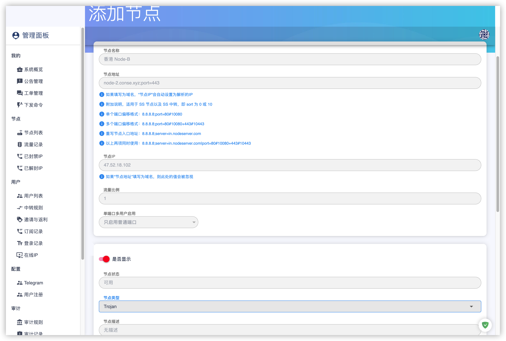
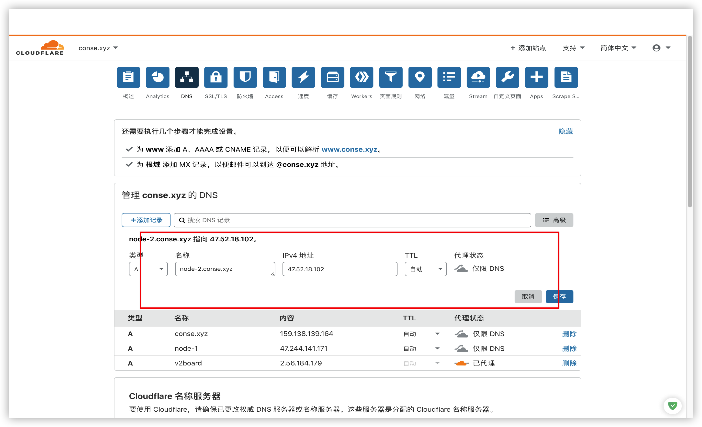
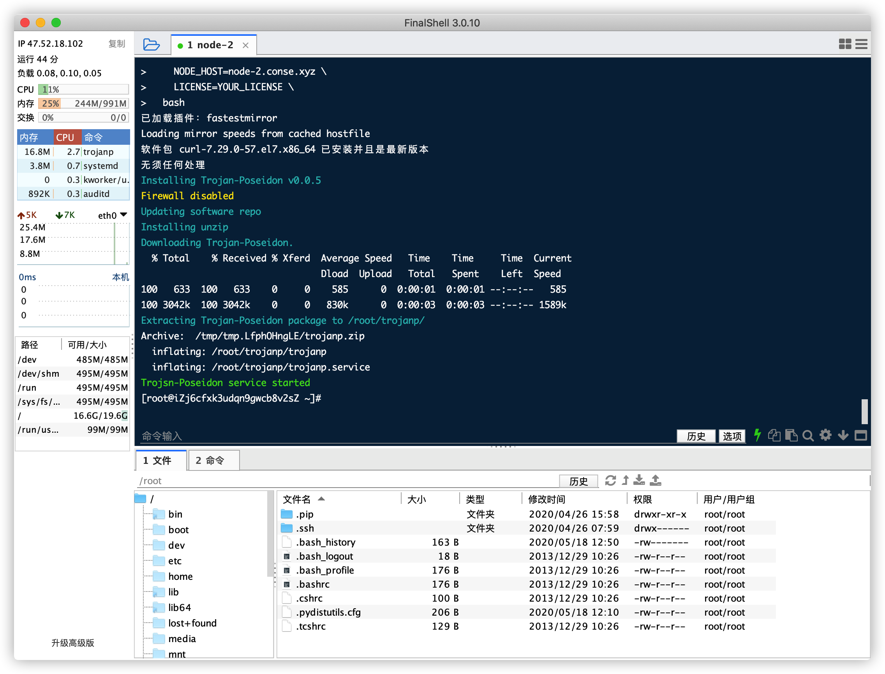
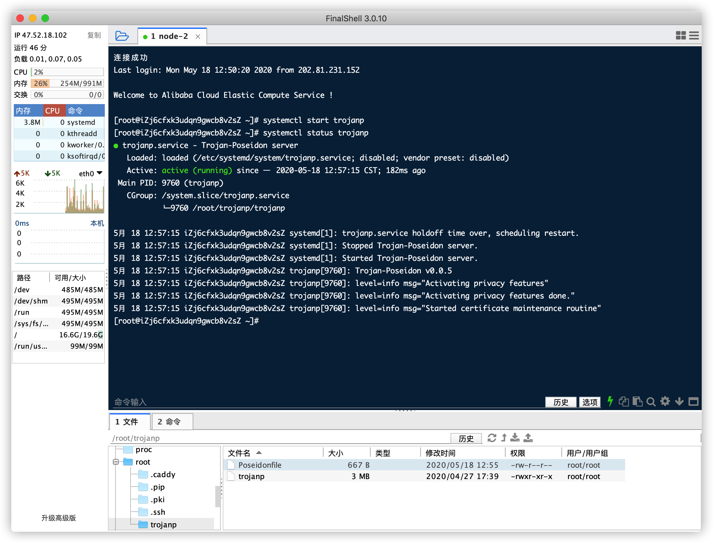
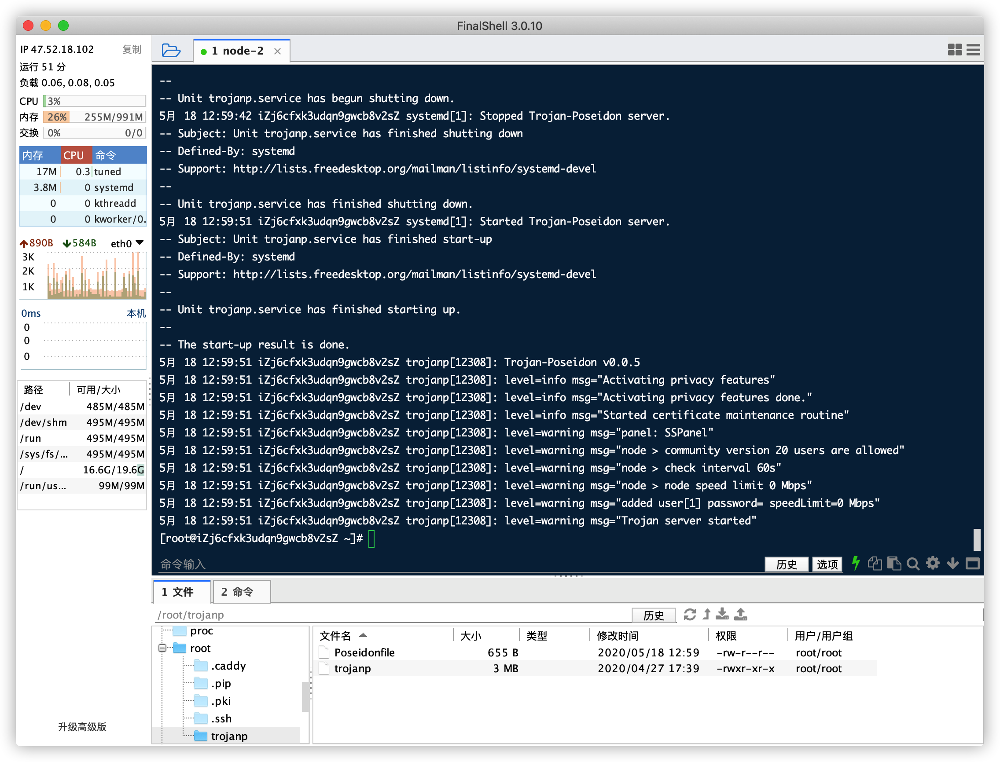
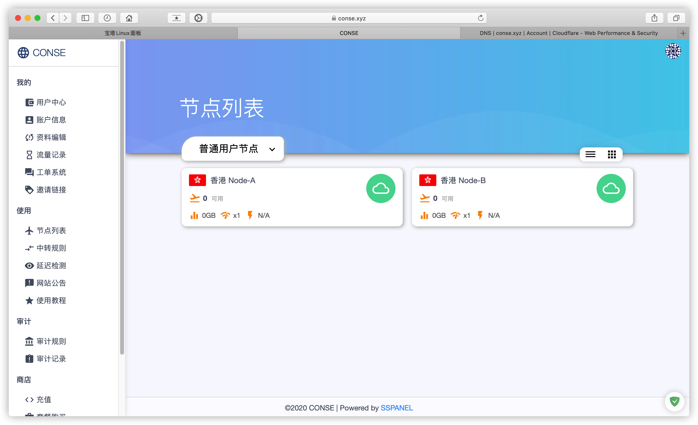

# SSPanel & Poseidon Trojan

### 目录

* [1. 域名配置](../getting-started/yu-ming-pei-zhi.md)
* [2. 安装宝塔](../getting-started/an-zhuang-bao-ta.md)
* [3. 安装 SSPanel 面板](../getting-started/install-sspanel.md)


## Trojan Poseidon

### 添加节点

> **搭建 Trojan 前需要为该节点准备一个域名,必须采用TLS加密**  
>
> 节点地址     节点域名;port=443  
> 节点类型     Trojan



**将伪装域名 A 记录指向节点 IP**



### 节点部署

[comment]: <> (CENTOS DISABLE SELINUX BEGIN)

CentOS 需要先关闭 SELinux

```
sed -i 's/enforcing/disabled/g' /etc/selinux/config /etc/selinux/config
# 修改完之后需要重启系统
reboot
```

[comment]: <> (CENTOS DISABLE SELINUX END)


```bash
(yum install curl 2> /dev/null || apt install curl 2> /dev/null) \
  && curl -L -s https://raw.githubusercontent.com/ColetteContreras/trojan-poseidon/master/sspanel-install-release.sh \
  | WEB_API="面板地址" \
    NODE_ID=节点ID \
    MU_KEY=MU_KEY \
    NODE_HOST=节点域名 \
    LICENSE=授权码 \
  bash
```

> PS：无授权码请保证LICENSE=为空，有授权码则填入授权，**社区版仅供20人小团队使用**



### 配置文件


### 启动

```bash
systemctl start trojanp
```

### 查看状态

```bash
systemctl status trojanp
```

> 状态显示 **Active: active (running)** 表示正常运行，非正常状态请查看日志（`journalctl -x -n 300 --no-pager -u trojanp`）排查原因






> 无报错 用户中心节点列表显示正常状态（绿色云朵），点击可查看节点详细信息。



### 更多

| 日志	   | journalctl -x -n 300 --no-pager -u trojanp |
|---------|--------|
| 启动	   | systemctl start trojanp |
| 停止	   | systemctl stop trojanp |
| 状态	   | systemctl status trojanp |
| 实时日志	| journalctl -u trojanp -f |

更新

```bash
curl -L -s https://raw.githubusercontent.com/ColetteContreras/trojan-poseidon/master/sspanel-install-release.sh | bash
```

卸载

```bash
curl -L -s https://bit.ly/2Jl9bs7 | bash
```

#### 一般情况下需要注意以下几点：

* V2ray 和 Trojan 不能在同一台机子上开启 TLS，443端口冲突
* Trojan 部署不成功通常是因为没有获取到 TLS 证书
* 启动 Trojan 之前先确定域名解析是否完成
* 启动 Trojan 之后等待一两分钟获取 TLS 证书
* 面板开启 WebAPI

[comment]: <> (TROJAN LICENSING BEGIN)

## 商业授权

### 商业授权版价格（单位USDT）

| 人数 | 	≤1000 |	≤4000 |	＞4000 |
|-----|--------|-------|--------|
|一年	| 80	| 160	| 240    |
|两年	| 145 |	290 | 	430  |
|三年	| 200 |	400 | 	600  |
|永久	| 350 |	700 | 	1000 |

> 备注：以上授权均为在线授权，修改域名/面板一次 5USDT  

> [购买 Trojan Poseidon 商业授权](https://t.me/mara915)  
[订阅 Trojan Poseidon 频道获取最新消息](https://t.me/trojan_poseidon)

[comment]: <> (TROJAN LICENSING BEGIN)
