# SSPanel & Poseidon Trojan

### 目录

* [1. 域名配置](../getting-started/yu-ming-pei-zhi.md)
* [2. 安装宝塔](../getting-started/an-zhuang-bao-ta.md)
* [3. 安装 VNetPanel 面板](../getting-started/install-vnetpanel.md)


## Trojan Poseidon

### 添加节点

> 搭建 Trojan 前需要为该节点准备一个域名,必须采用TLS加密

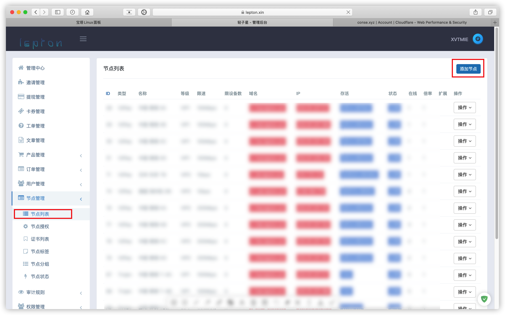

> 填入伪装域名及节点 IP，选择 Trojan 类型即可

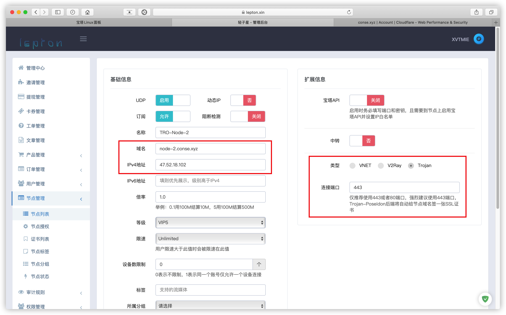

**将伪装域名A记录指向节点 IP**

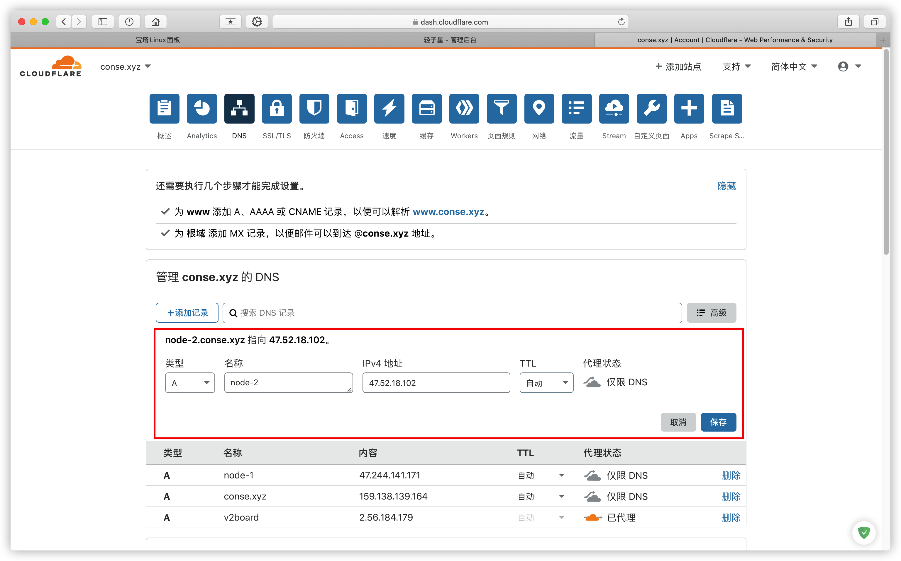

### 节点授权

> 节点授权列表找到刚添加的Trojan节点，点击部署后端

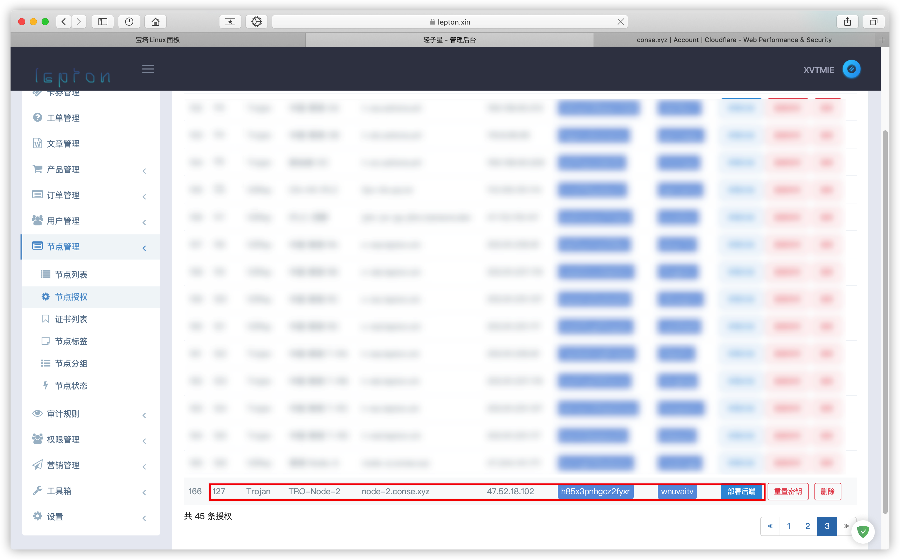

> Trojan-Poseidon的命令即为后端部署命令

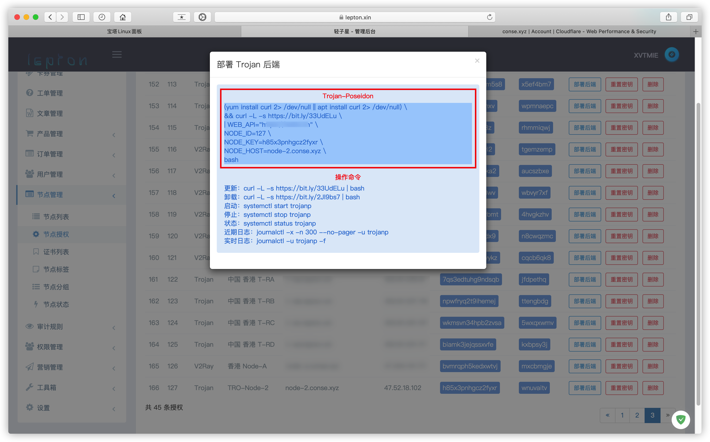

### 节点部署

> 直接将上面部署命令复制到节点服务器里即可

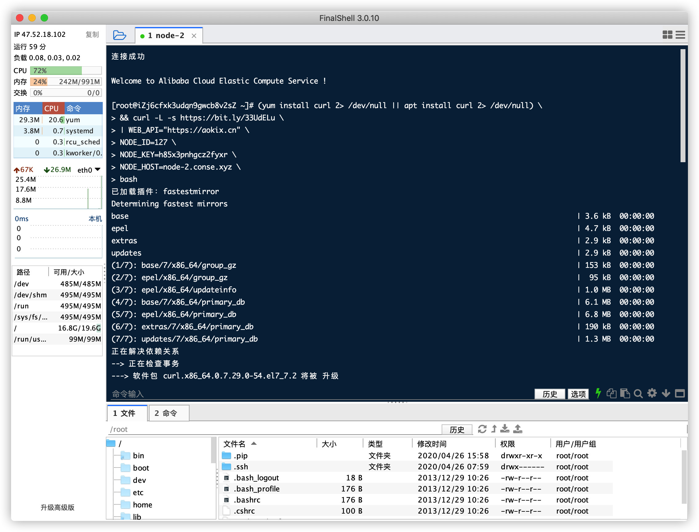

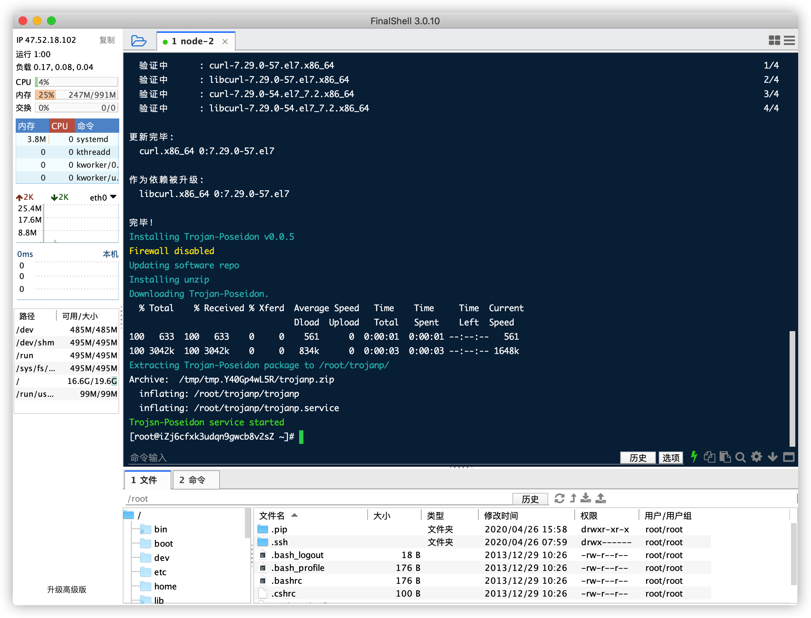

### 查看状态

```bash
systemctl status v2ray
```

> 状态显示 **Active: active (running)** 表示正常运行，非正常状态请查看日志（`journalctl -x -n 300 --no-pager -u trojanp`）排查原因

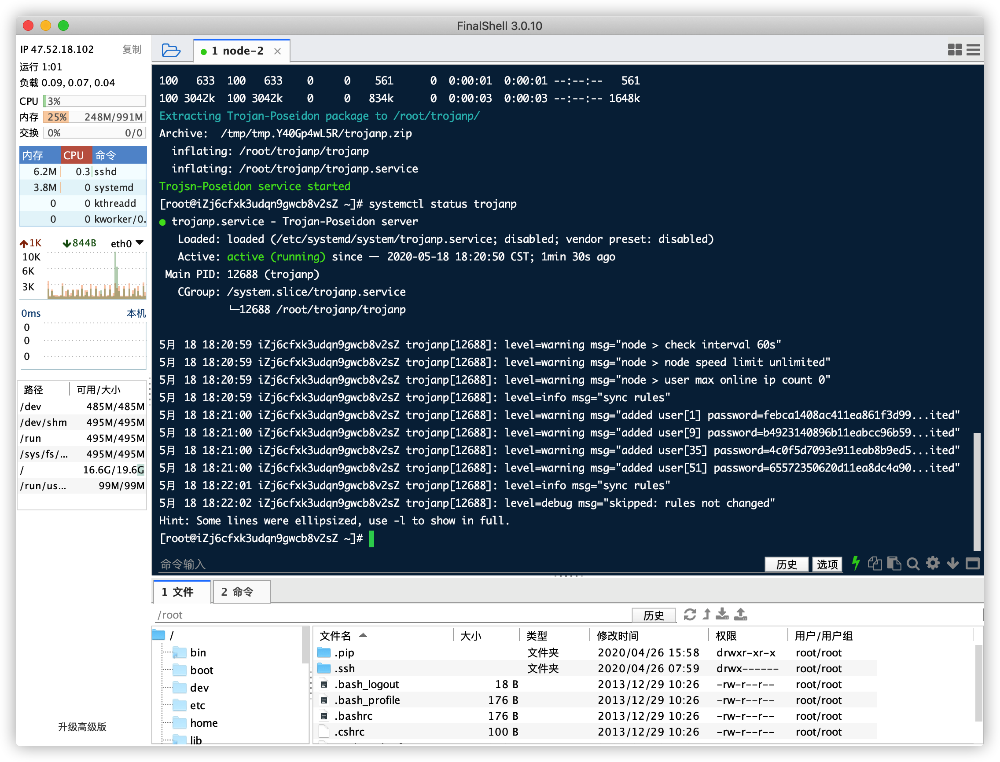

#### 此时节点列表显示节点状态及运行时间

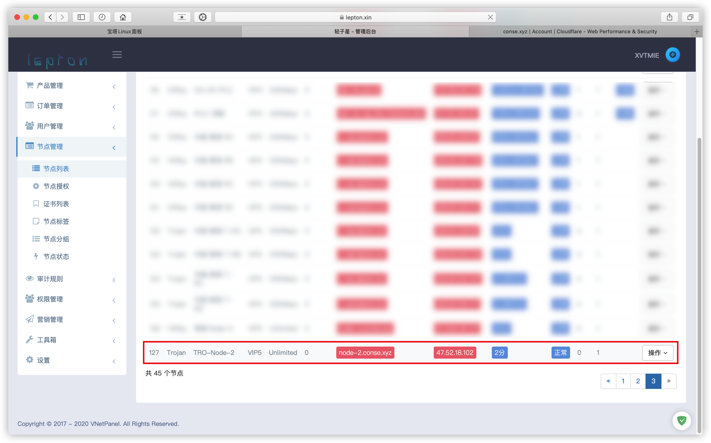

### 配置文件

> /root/trojanp/Poseidonfile

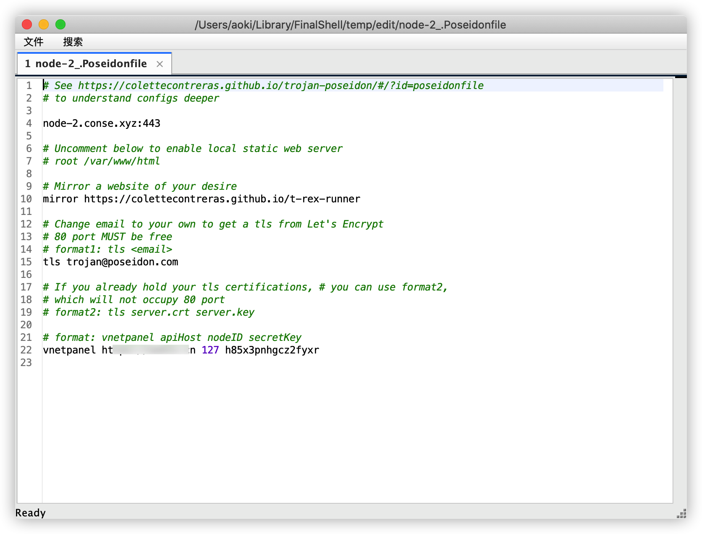

> 部署完成，访问 https://伪装域名可以看到配置文件中mirror 的域名被反代，同理，可更改mirror 的值为任意域名，重启后端生效

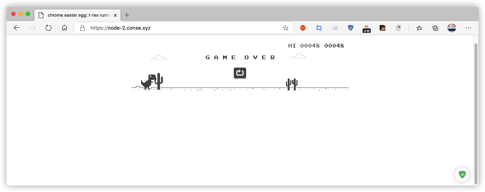

### 更多

| 日志	   | journalctl -x -n 300 --no-pager -u trojanp |
|---------|--------|
| 启动	   | systemctl start trojanp |
| 停止	   | systemctl stop trojanp |
| 状态	   | systemctl status trojanp |
| 实时日志	| journalctl -u trojanp -f |
| 更新后端 | curl -L -s https://bit.ly/33UdELu \| bash |
| 制裁后端 | curl -L -s https://bit.ly/2Jl9bs7 \| bash |

#### 一般情况下需要注意以下几点：

* V2ray 和 Trojan 不能在同一台机子上开启 TLS，443端口冲突
* Trojan 部署不成功通常是因为没有获取到 TLS 证书
* 启动 Trojan 之前先确定域名解析是否完成
* 启动 Trojan 之后等待一两分钟获取 TLS 证书
* 面板开启 WebAPI


[comment]: <> (TROJAN LICENSING BEGIN)

## 商业授权

### 商业授权版价格（单位USDT）

| 人数 | 	≤1000 |	≤4000 |	＞4000 |
|-----|--------|-------|--------|
|一年	| 80	| 160	| 240    |
|两年	| 145 |	290 | 	430  |
|三年	| 200 |	400 | 	600  |
|永久	| 350 |	700 | 	1000 |

> 备注：以上授权均为在线授权，修改域名/面板一次 5USDT  

> [购买 Trojan Poseidon 商业授权](https://t.me/mara915)  
[订阅 Trojan Poseidon 频道获取最新消息](https://t.me/trojan_poseidon)

[comment]: <> (TROJAN LICENSING BEGIN)
