# 搭配 VNetPanel 面板

## 部署准备

> Linux 服务器（操作系统Centos7）  
> 域名  
> Shell 终端  
> VNetPanel，该面板为付费面板，请找 [VNetPanel 作者](https://t.me/esp8266mod) 或 [藤原 佑为](https://t.me/garhing) 进行购买

## 域名解析

[域名解析](https://github.com/poseidon-gfw/poseidon-gfw.github.io/tree/420d1b3dcd2da1b399cb84712207eeed6e5adf67/_include/_setup_domain.md)

## VNetPanel 面板部署

[VNetPanel 面板部署](https://github.com/poseidon-gfw/poseidon-gfw.github.io/tree/420d1b3dcd2da1b399cb84712207eeed6e5adf67/_include/_setup_vnetpanel.md)

### 商业授权

**填入Poseidon授权码及TLS配置，授权码需要购买，无试用。**

> TLS配置（以CloudFlare为例）

```javascript
{"provider": "cloudflare", "email": "", "api_key": ""}
```

**获取 CloudFlare api\_key**

> CloudFlare -&gt; 右上角头像 -&gt; 我的个人资料 -&gt; API令牌 -&gt; Global API Key -&gt; 查看

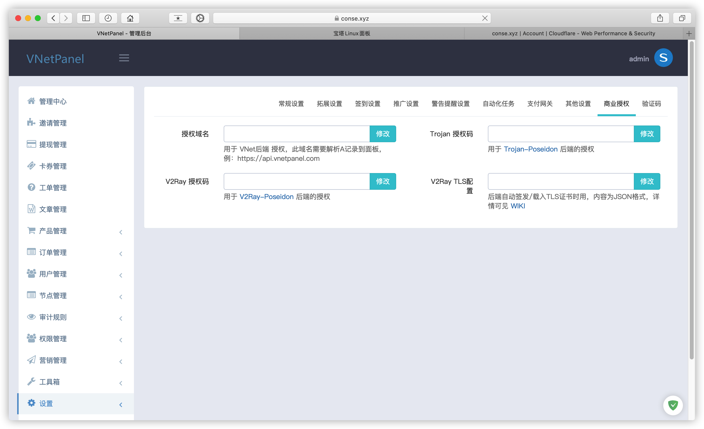

## 节点部署（以WebSocket-TLS 模式为例）

> 节点服务器 Centos7 X64

通过SSH工具访问服务器

### 安装加速

> 推荐使用BBR2或BBRPlus

```bash
yum install wget
wget -N --no-check-certificate "https://github.000060000.xyz/tcp.sh" && chmod +x tcp.sh && ./tcp.sh
```


**reboot** 重启完成后 `./tcp.sh` 进入管理脚本，开启加速

 

[同步时间](https://github.com/poseidon-gfw/poseidon-gfw.github.io/tree/420d1b3dcd2da1b399cb84712207eeed6e5adf67/_include/_sync_date_time.md)

#### 关闭防火墙

```bash
systemctl disable firewalld
systemctl stop firewalld
```


### 添加伪装域名

> 节点管理 -&gt; 证书列表 -&gt; 添加域名证书

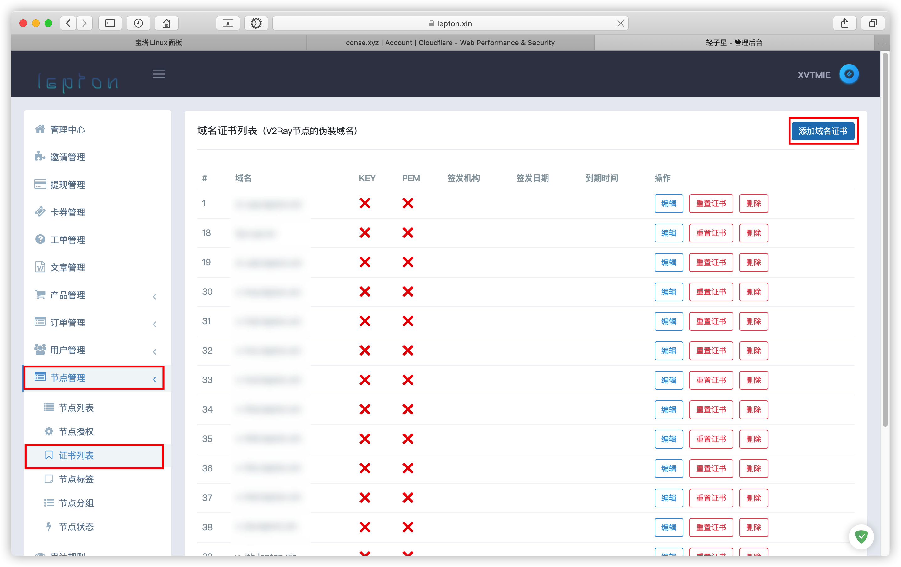

> **填写伪装域名，KEY和PEM为证书，可填可不填**

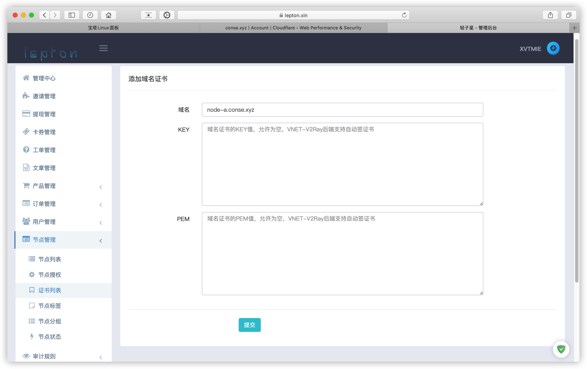

#### CloudFlare 节点域名解析，将节点地址通过A记录指向节点服务器 IP，云朵灰色

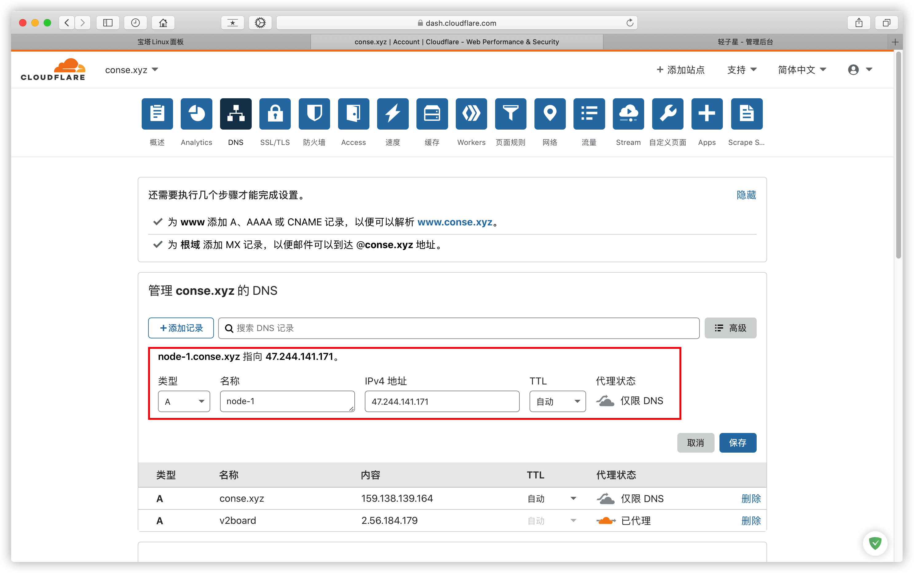

#### 新增节点

**TLS+WebSocket模式**

> 域名与伪装域名相同

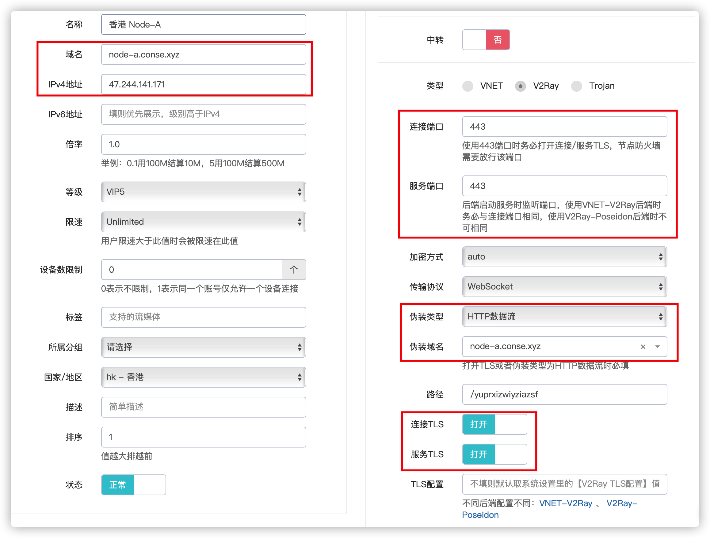

**WebSocket模式**

> 连接端口和服务端口可任意更换  
> 域名与伪装域名相同

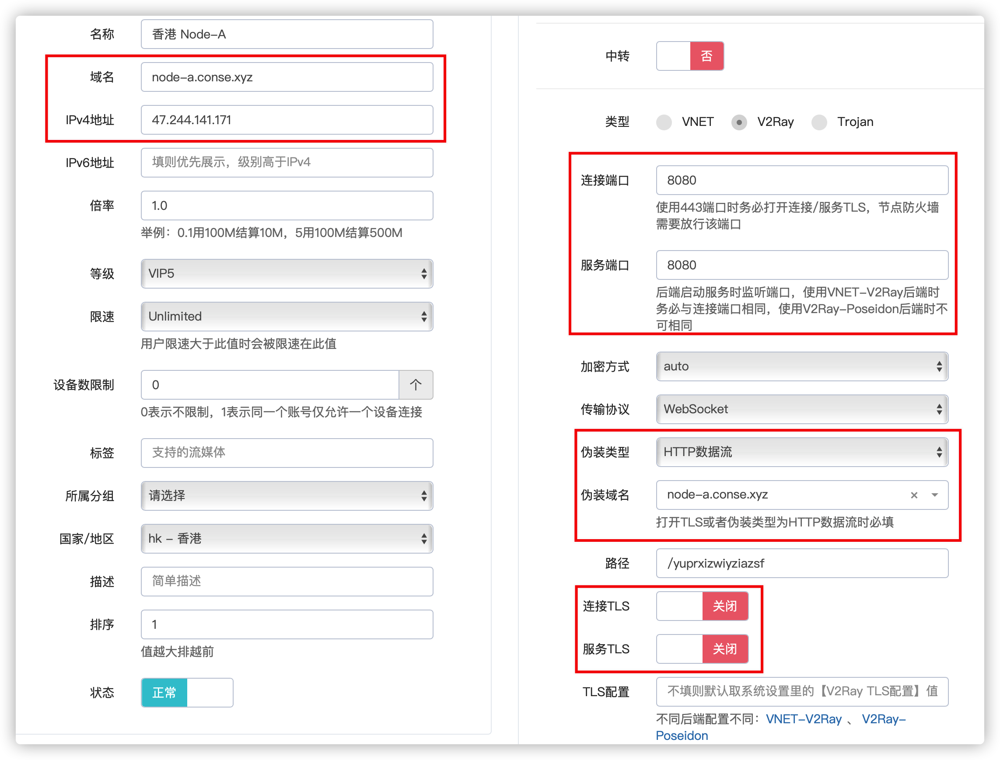

#### 节点授权

> 在节点授权界面找到刚添加的节点 点击部署后端

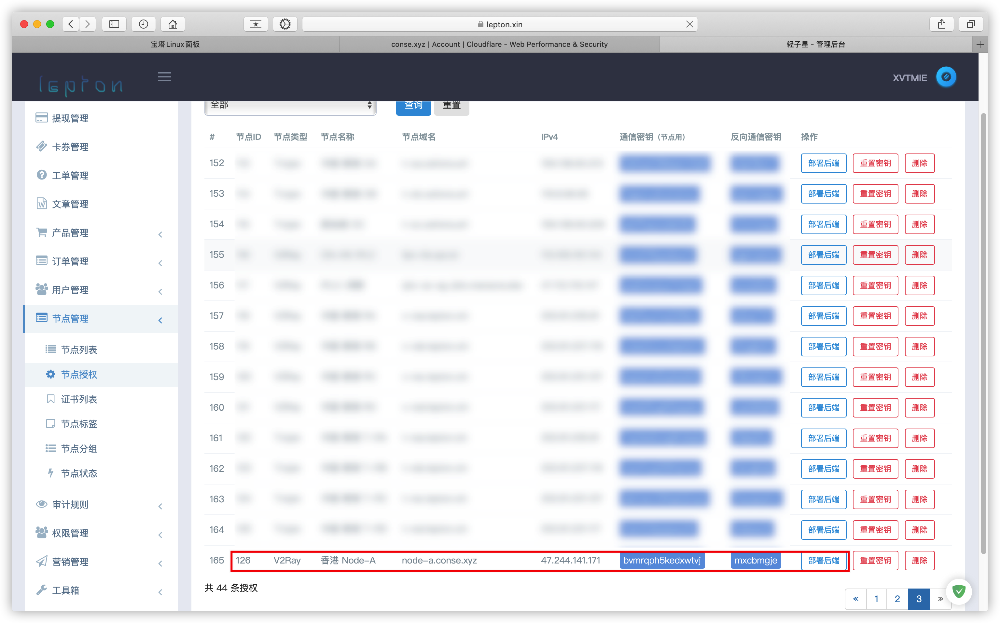

> 弹出的V2Ray-Poseidon命令为节点部署命令

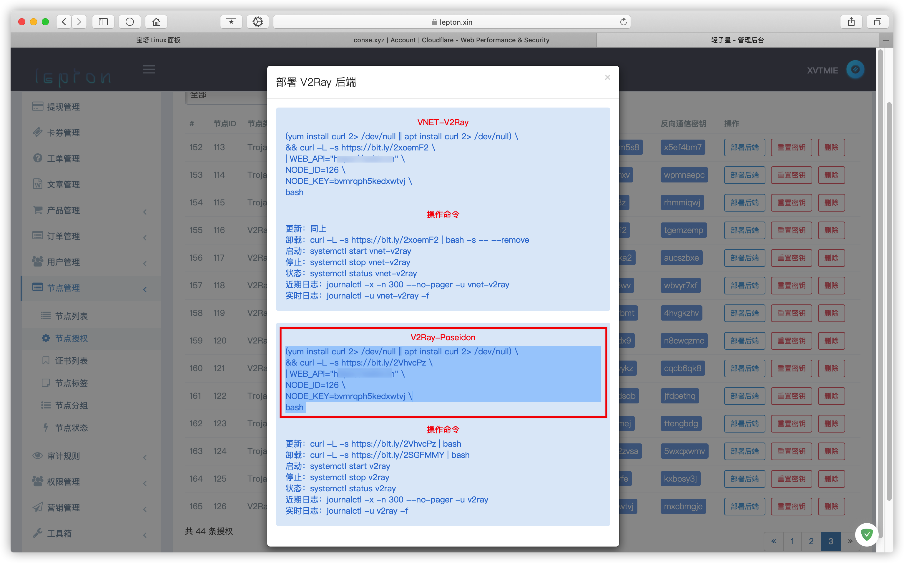

### 部署节点

> 将上面的部署命令直接复制到节点服务器终端，运行即可

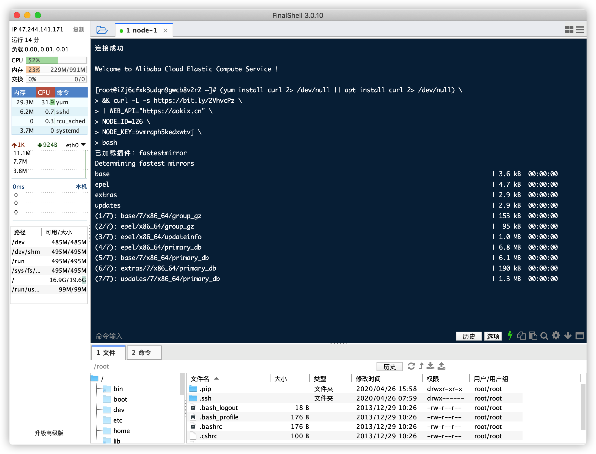

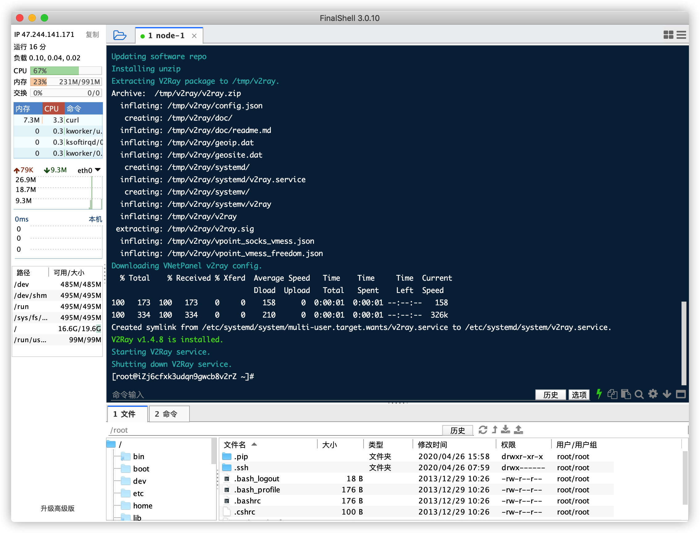

#### 查看运行状态

```bash
systemctl status v2ray
```

> 状态显示 **Active: active \(running\)** 表示正常运行，非正常状态请查看日志（journalctl -x -n 300 --no-pager -u v2ray ）排查原因

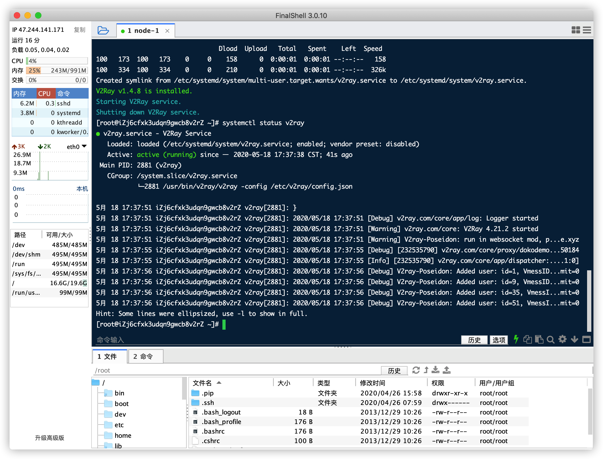

#### 此时节点列表显示节点状态及运行时间

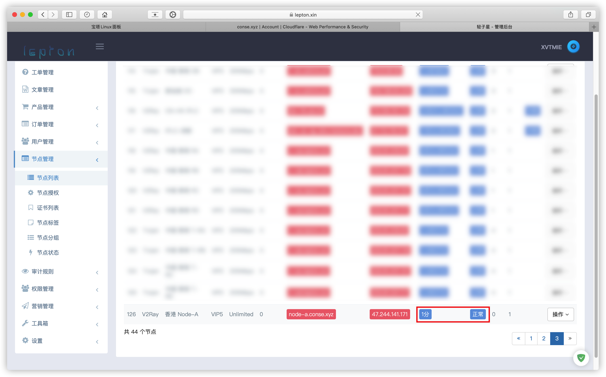

> 无法正常使用请获取运行日志到 [V2Ray Poseidon](https://t.me/v2ray_poseidon) 提问

### 更多命令

> 更新 **curl -L -s** [https://bit.ly/2VhvcPz](https://bit.ly/2VhvcPz) **\| bash**  
> 卸载 **curl -L -s** [https://bit.ly/2SGFMMY](https://bit.ly/2SGFMMY) **\| bash**

| 日志 | journalctl -x -n 300 --no-pager -u v2ray |
| :--- | :--- |
| 停止 | systemctl stop v2ray |
| 状态 | systemctl status v2ray |
| 启动 | systemctl start v2ray |
| 重启 | systemctl restart v2ray |

### 更多配置模式

先介绍下 VNetPanel 节点设置的几个参数，明白之后就可以自由组合了。

| 参数 | 说明 |
| :--- | :--- |
| 服务端口 | V2Ray 所监听的端口 |
| 连接端口 | 用户连接时的端口，直连 V2Ray 的话和服务端口一致，如果不是直连比如通过了中转或使用了反向代理进行转发，则填写中转或反向代理的端口 |
| 服务端 | TLS    是否启用 V2Ray TLS，原始的 V2Ray 需要自己去处理证书，V2Ray-Poseidon可以自动帮你处理 TLS 证书，请参阅《配置 TLS 证书》提供相应的信息 |
| 连接 | TLS    用户连接时是否启用 TLS |
| TLS | 服务商授权    当服务端 TLS为启用时，必须配置该参数 |

#### TCP 模式

> 传输协议 =&gt; TCP  
> 服务端 TLS =&gt; 禁用  
> 服务端口 =&gt; 10086 \( 你可以设置为你可用的任何端口 \)  
> 连接端口 =&gt; 10086

#### 给 TCP 套上 TLS 证书

> 准备一个域名比如 v2node-01.vnetpanel.com，并解析到该节点地址  
> 域名和伪装域名都设置为 v2node-01.vnetpanel.com  
> 传输协议改成 TCP  
> 启用 TLS  
> TLS服务商授权 参照《配置 TLS 证书》规则，填上你域名提供商的信息

#### WebSocket 模式 \(直连\)

> 传输协议改成 WebSocket  
> 禁用 TLS  
> 保证路径不为空，由 VNetPanel 自动生成的就非常安全，例如：/gahutaodoy8dcs21，每个节点都不一样

#### WebSocket + 百度 CDN

> 据 @vft9ness 大佬所说：使用百度 CDN 都不建议开启 TLS，所以直接按《WebSocket 模式》配置，然后把端口改为 80即可。

#### WebSocket + TLS 模式 \(直连\)

> 准备一个域名比如 v2node-01.vnetpanel.com，并解析到该节点地址，保证 CF 后面的小云朵为灰色的  
> 域名和伪装域名都设置为 v2node-01.vnetpanel.com  
> 传输协议改成 WebSocket  
> 保证路径不为空，由 VNetPanel 自动生成的就非常安全，例如：/gahutaodoy8dcs21，每个节点都不一样  
> 服务端口 =&gt; 443 \( 你可以设置为你可用的任何端口 \)  
> 连接端口 =&gt; 443  
> 服务端 TLS =&gt; 启用  
> 连接 TLS =&gt; 启用  
> TLS服务商授权 参照《配置 TLS 证书》规则，填上你域名提供商的信息

#### WebSocket + CloudFlare CDN = WebSocket + CF CDN + TLS\(这个证书是由 CF 自动生成的）

> 准备一个域名比如 v2node-01.vnetpanel.com，并解析到该节点地址，并点亮 CF 后面的小云朵，CF 的 SSL/TLS 改为 Flexible  
> 域名和伪装域名都设置为v2node-01.vnetpanel.com  
> 服务端口 =&gt; 80  
> 连接端口 =&gt; 443  
> 传输协议 =&gt; WebSocket  
> 保证路径不为空，由 VNetPanel 自动生成的就非常安全，例如：/gahutaodoy8dcs21，每个节点都不一样  
> 服务端 TLS =&gt; 关闭  
> 连接 TLS =&gt; 启用

### 配置 TLS 证书

[tls\_json](https://github.com/poseidon-gfw/poseidon-gfw.github.io/tree/420d1b3dcd2da1b399cb84712207eeed6e5adf67/_include/tls_json.md)

[Licensing](https://github.com/poseidon-gfw/poseidon-gfw.github.io/tree/420d1b3dcd2da1b399cb84712207eeed6e5adf67/_include/_licensing.md)

