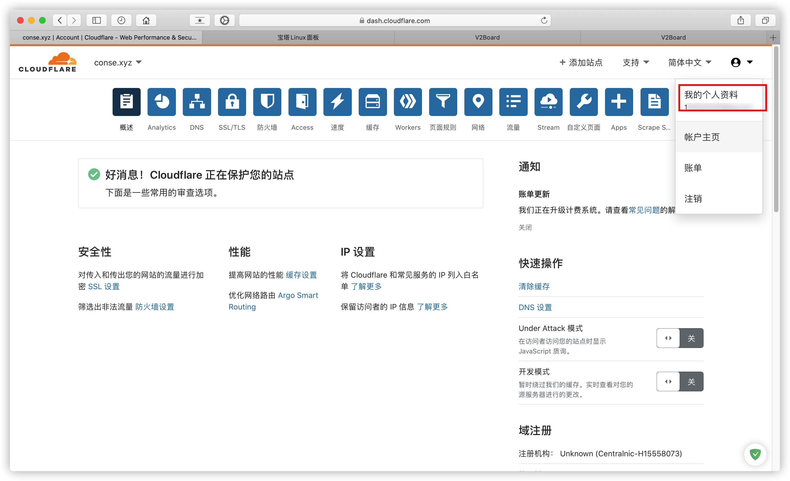

# SSPanel & V2Ray Poseidon

### 目录

* [1. 域名配置](../getting-started/yu-ming-pei-zhi.md)
* [2. 安装宝塔](../getting-started/an-zhuang-bao-ta.md)
* [3. 安装 SSPanel 面板](../getting-started/install-sspanel.md)

## 节点部署（以WebSocket-TLS 模式为例）

> 节点服务器 Centos7 X64

通过SSH工具访问服务器

[comment]: <> (CENTOS DISABLE SELINUX BEGIN)

CentOS 禁用 SELinux

```
sed -i 's/enforcing/disabled/g' /etc/selinux/config /etc/selinux/config
# 修改完之后需要重启系统
reboot
```

[comment]: <> (CENTOS DISABLE SELINUX END)

安装加速

> 推荐使用BBR2或BBRPlus

```bash
yum install wget
wget -N --no-check-certificate "https://github.000060000.xyz/tcp.sh" && chmod +x tcp.sh && ./tcp.sh
```


> **reboot** 重启完成后 `./tcp.sh` 进入管理脚本，开启加速


[comment]: <> (同步时间 BEGIN)

### 同步时间

#### Debian/Ubuntu

```bash
apt-get install -y ntp
service ntp restart
```

#### CentOS/RHEL

```bash
yum -y install ntpdate
timedatectl set-timezone Asia/Shanghai
ntpdate ntp1.aliyun.com
```


[comment]: <> (同步时间 END)

关闭防火墙

```bash
systemctl disable firewalld
systemctl stop firewalld
```


安装并启动 Docker/docker-compose

```bash
curl -fsSL https://get.docker.com | bash
curl -L "https://github.com/docker/compose/releases/download/1.25.3/docker-compose-$(uname -s)-$(uname -m)" -o /usr/local/bin/docker-compose
chmod a+x /usr/local/bin/docker-compose
rm -f `which dc`
ln -s /usr/local/bin/docker-compose /usr/bin/dc

systemctl start docker
service docker start
systemctl enable docker.service
systemctl status docker.service

```

**依次** 执行上面命令，**docker.service为active (running)** 时表示正常


CloudFlare节点域名解析，将节点地址通过A记录指向节点服务器iP，云朵灰色


### 新增节点(TLS+WebSocket模式)

| 节点名称	 | 国家 地区 编号(随意） |
|----|---|
| 节点地址	 | 在下面 |
| 节点iP	 |  留空或填写节点服务器IP |
| 节点类型	 | V2ray |


> 地址解析 你的域名;443;2;tls;ws;path=/|host=你的域名  
举个例子 node-1.conse.xyz;443;32;tls;ws;path=/|host=node-1.conse.xyz


### 获取后端

```bash
yum install -y git 2> /dev/null || apt install -y git
git clone https://github.com/ColetteContreras/v2ray-poseidon.git
```


修改配置文件

修改 `/root/v2ray-poseidon/docker/sspanel/ws-tls` 目录下的 `config.json`

> "nodeId": // 面板里添加完节点后生成的自增ID  
"license_key": "",//商业授权码  
"panelUrl": "",// SSPanel 面板地址  
"panelKey": "", // SSPanel 面板的配置文件中的 muKey 的值


修改 `/root/v2ray-poseidon/docker/sspanel/ws-tls` 目录下的 `docker-compose.yml`

> command: tls cloudflare 节点域名  
例子： command: tls cloudflare node-1.conse.xyz  
服务端口改为443  
CF_API_EMAIL= 你的Cloudflare账户  
CF_API_KEY=你的Cloudflare key  


Cloudflare key获取

> CloudFlare-右上角头像-我的个人资料-API令牌-Global API Key-查看




编辑完成后保存

### 启动节点

```bash
cd /root/v2ray-poseidon/docker/sspanel/ws-tls
dc up -d
```


### 查看运行日志

```bash
dc logs
```

用户中心 节点列表 云朵呈绿色代表正常


> 无法正常使用请获取运行日志到 [V2Ray Poseidon](https://t.md/v2ray_poseidon) 提问

### 更多节点配置

> /root/v2ray-poseidon/docker/sspanel

### TCP 模式

> SSPanel 面板中的节点地址设置为：`你的IP或域名;10086;2;tcp;;` 除了前面的 IP和端口外其它啥也不要动，原样的复制过去

```bash
cd tcp
```

1. 修改 config.json 中的 poseidon 下面的配置

2. 修改 docker-compose.yml 的服务端口

启动

```bash
dc up -d
```

### CloudFlare CDN + WebSocket 模式1

> SSPanel 面板中的节点地址设置为：**你的域名;443;0;tls;ws;path=/|host=你的域名** 除了把你的域名替换外其它啥也不要动，原样的复制过去。

1. CloudFlare 打开代理

2. 修改配置文件并启动 docker

```bash
cd ws
```

> 修改 config.json 中的 poseidon 下面的配置，注意端口相关的都不要修改

启动

```bash
dc up -d
```

### WebSocket-TLS 模式 2

> 该模式下请确保 CloudFlare 解析的那边图标是灰色的（也就是不用 CF 的 CDN，只用来做域名解析）

> SSPanel 面板中的节点地址设置为：**你的域名;443;0;tls;ws;path=/|host=你的域名** 除了把你的域名替换外其它啥也不要动，原样的复制过去。（端口其实也可以修改，不会的就别乱动了）

```bash
cd ws-tls
```

1. 修改 config.json 中的 poseidon 下面的配置

2. 修改 docker-compose.yml 中的配置，根据你的 DNS 信息

启动

```bash
dc up -d
```

更多

下列命令在 `/root/v2ray-poseidon/docker/sspanel/` 对应目录下执行

| 启动 |	dc up -d |
|----|----|
| 停止	| dc stop |
| 重启	| dc restart|
| 查看日志	| dc logs|

[comment]: <> (LICENSING BEGIN)
## 商业授权

> **Poseidon授权，未授权只能限制 50 人使用。**  
用户数说明：限制 50 人时，请按面板用户数来算，如果你发现超过 50 还能用，那是你赚到的，与此同时你需要承担相应的风险，可能在某个时刻后端会集体挂掉，重启也无法启动，所以请在面板人数小于等于 50 时，加群购买授权码，以防出现无法服务的情况。  
50人限制的真实含义：面板有效用户数。有效用户为那些有权连接到你的节点的用户，一般来说就是 **流量没超、还没到期、以及未被管理员封禁** 的那些用户。

### 商业授权版价格（单位USDT）

| 人数 | 	≤1000 |	≤4000 |	＞4000 |
|-----|--------|-------|--------|
|一年	| 80	| 160	| 240    |
|两年	| 145 |	290 | 	430  |
|三年	| 200 |	400 | 	600  |
|永久	| 350 |	700 | 	1000 |

> 备注：以上授权均为在线授权，修改域名/面板一次 5USDT  
> 该授权为虚拟物品，不支持退款，请先使用社区版测试所有功能，如果能达到您的预期再进行购买。

> [购买V2Ray Poseidon商业授权](https://t.me/mara915)

[comment]: <> (LICENSING END)
